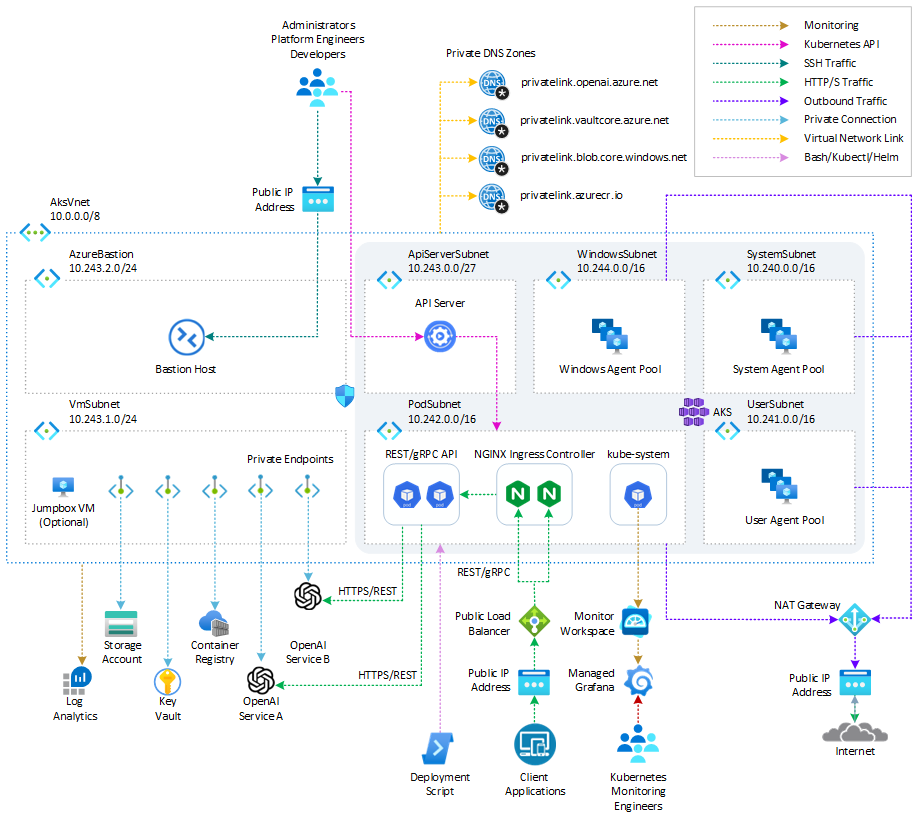
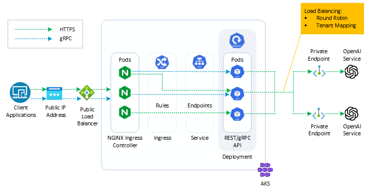
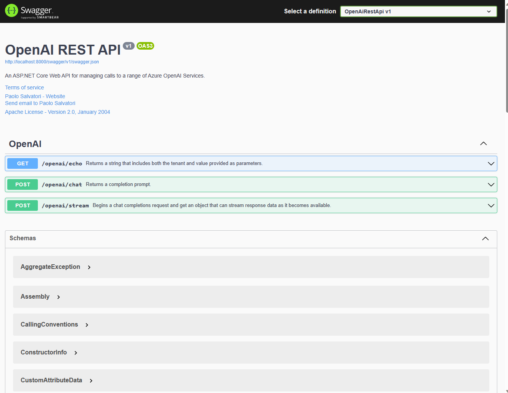
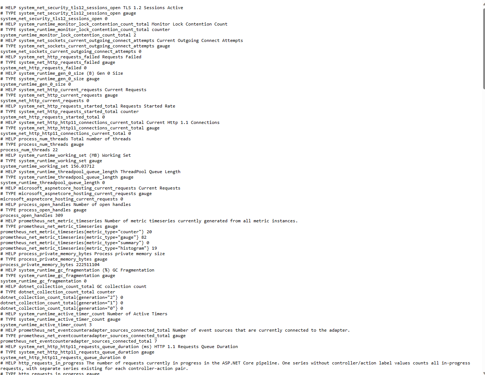
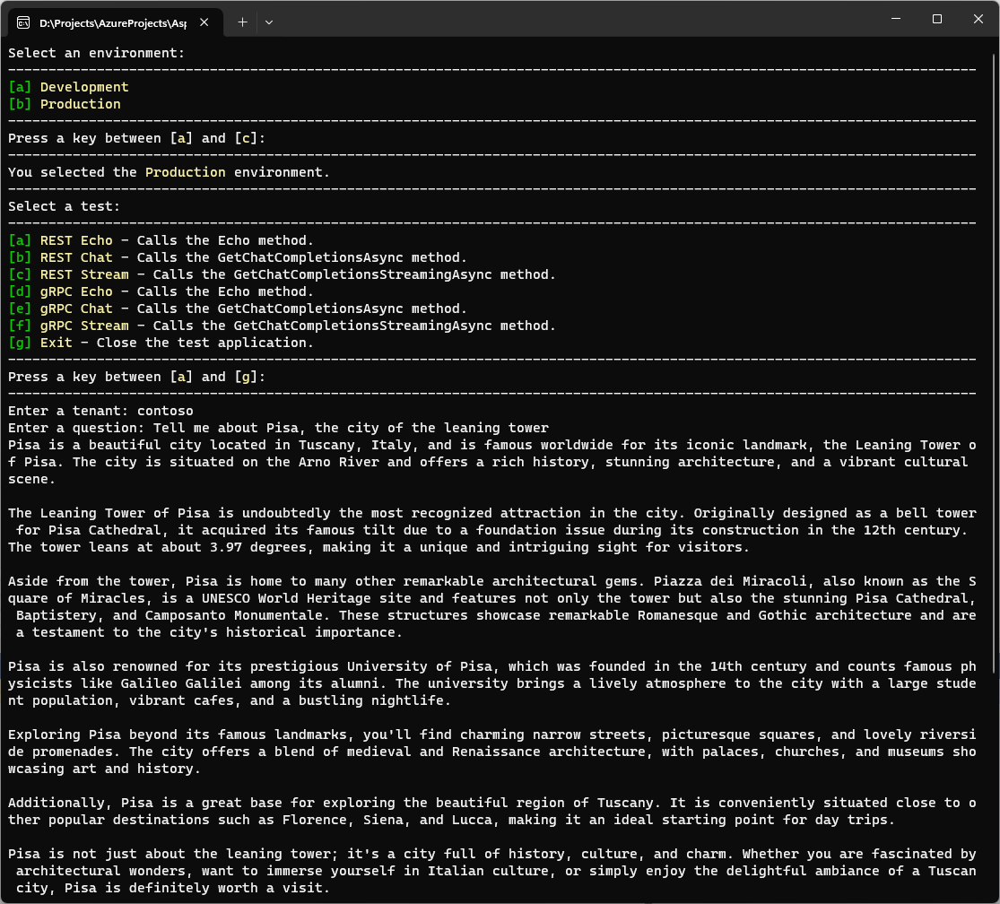
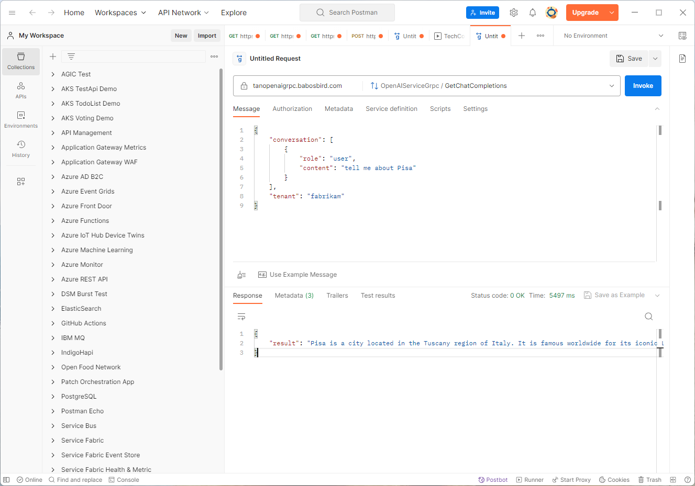
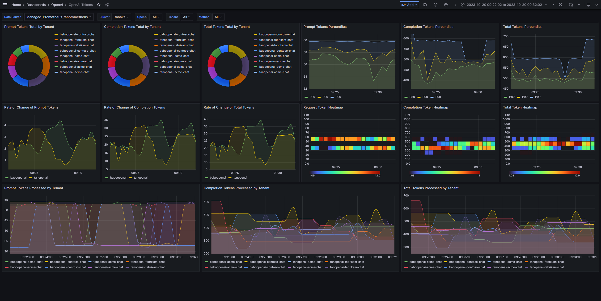

# Azure OpenAI Service Multitenant Load Balancing and TPM Handling

[Azure OpenAI Service](https://learn.microsoft.com/en-us/azure/ai-services/openai/overview) provides various [isolation and tenancy models](https://learn.microsoft.com/en-us/azure/architecture/guide/multitenant/service/openai) for different scenarios. Some models involve using a dedicated Azure OpenAI Service resource per tenant, while others rely on a multitenant application sharing one or more Azure OpenAI Service resources across multiple tenants. Sharing an Azure OpenAI Service instance across multiple tenants can potentially lead to a [Noisy Neighbor](https://learn.microsoft.com/en-us/azure/architecture/antipatterns/noisy-neighbor/noisy-neighbor) problem, resulting in higher latency for certain tenants. To mitigate this, it is crucial to ensure that your application code is multitenancy-aware and incorporates appropriate measures. For instance, if you aim to charge customers based on their usage of a shared Azure OpenAI instance, your application should include logic to monitor and track the total number of tokens consumed by each tenant. This article is primarily focused on showcasing the capabilities of a multitenant service, specifically in terms of evenly distributing and load balancing requests across multiple [Azure OpenAI Service](https://learn.microsoft.com/en-us/azure/ai-services/openai/overview) instances, all while effectively managing and tracking [tokens per minute (TPM)](https://learn.microsoft.com/en-us/azure/ai-services/openai/how-to/quota) for multiple tenants. The article and companion sample provide implementation details for achieving the following:

- Distributing calls across multiple [Azure OpenAI Service](https://learn.microsoft.com/en-us/azure/ai-services/openai/overview) instances using a [round-robin scheduling algorithm](https://en.wikipedia.org/wiki/Round-robin_scheduling) or mapping requests to specific instances based on tenant names.
- Instrumenting the application with custom [Prometheus metrics](https://prometheus.io/docs/concepts/metric_types/), leveraging the [prometheus-net](https://github.com/prometheus-net/prometheus-net#gauges) .NET library, to measure per-tenant request tokens, completion tokens, and total tokens.
- Creating a C# ASP.NET service using .NET Standard that accepts REST and gRPC protocol calls.
- Making asynchronous calls to the Azure OpenAI Service REST API using the [OpenAIClient.GetChatCompletionsAsync](https://learn.microsoft.com/en-us/dotnet/api/azure.ai.openai.openaiclient.getchatcompletionsasync?view=azure-dotnet-preview) and [OpenAIClient.GetChatCompletionsStreamingAsync](https://learn.microsoft.com/en-us/dotnet/api/azure.ai.openai.openaiclient.getchatcompletionsstreamingasync?view=azure-dotnet-preview) methods from the [Azure OpenAI client library for .NET](https://learn.microsoft.com/en-us/dotnet/api/overview/azure/ai.openai-readme?view=azure-dotnet-preview).
- Utilizing the [SharpToken](https://github.com/dmitry-brazhenko/SharpToken) C# library to calculate the number of promot, completion, and total tokens. SharpToken is a C# port of the Python [tiktoken](https://github.com/openai/tiktoken) library.
- Building and testing the application locally using [Docker Compose](https://docs.docker.com/compose/) to containerize the service alongside local instances of [Prometheus](https://prometheus.io/) and [Grafana](https://grafana.com/).
- Testing the REST and gRPC service interfaces with tools like [Postman](https://blog.postman.com/postman-now-supports-grpc/) or a console application.
- Simulating requests from multiple tenants using a bash script.
- Deploying the service to [Azure Kubernetes Service (AKS)](https://learn.microsoft.com/en-us/azure/aks/intro-kubernetes) using YAML manifests.
- Configuring the [NGINX ingress controller](https://docs.nginx.com/nginx-ingress-controller/intro/how-nginx-ingress-controller-works/) to support both REST and [gRCP](https://kubernetes.github.io/ingress-nginx/examples/grpc/) protocols.
- Configuring the AKS workload to access Azure OpenAI Service resources via [Microsoft Entra Workload ID](https://learn.microsoft.com/en-us/azure/aks/workload-identity-overview?tabs=dotnet).
- Deploying [Prometheus](https://prometheus.io/) and [Grafana](https://grafana.com/) to your AKS cluster using the [kube-prometheus-stack](https://artifacthub.io/packages/helm/prometheus-community/kube-prometheus-stack) Helm chart or use [Azure Monitor managed service for Prometheus](https://learn.microsoft.com/en-us/azure/azure-monitor/essentials/prometheus-metrics-overview) and [Azure Managed Grafana](https://learn.microsoft.com/en-us/azure/managed-grafana/overview) to collect and visualize Prometheus metrics.
- Creating and deploying a Grafana dashboard to visualize TPM Prometheus metrics.
- Customizing scraping of Prometheus metrics in [Azure Monitor managed service for Prometheus](https://learn.microsoft.com/en-us/azure/azure-monitor/essentials/prometheus-metrics-overview).

For more information related to the covered topics, refer to the following articles:

- [Multitenancy and Azure OpenAI Service](https://learn.microsoft.com/en-us/azure/architecture/guide/multitenant/service/openai)
- [Manage Azure OpenAI Service quota](https://learn.microsoft.com/en-us/azure/ai-services/openai/how-to/quota?tabs=rest#understanding-rate-limits)
- [Working with the GPT-35-Turbo and GPT-4 models](https://learn.microsoft.com/en-us/azure/ai-services/openai/how-to/chatgpt?pivots=programming-language-chat-completions&tabs=python)
- [Azure OpenAI Service quotas and limits](https://learn.microsoft.com/en-us/azure/ai-services/openai/quotas-limits)
- [Microsoft Entra Workload ID with Azure Kubernetes Service (AKS)](https://learn.microsoft.com/en-us/azure/aks/workload-identity-overview?tabs=dotnet)
- [Customize scraping of Prometheus metrics in Azure Monitor managed service for Prometheus](https://learn.microsoft.com/en-us/azure/azure-monitor/containers/prometheus-metrics-scrape-configuration)
- [NGINX Ingress Controller and gRPC protocol support](https://kubernetes.github.io/ingress-nginx/examples/grpc/)
- [Testing gRPC services with Postman or gRPCurl in ASP.NET Core](https://learn.microsoft.com/en-us/aspnet/core/grpc/test-tools?view=aspnetcore-7.0)
- [Postman gRPC Support](https://blog.postman.com/postman-now-supports-grpc/)
- [SharpToken C# Library](https://github.com/dmitry-brazhenko/SharpToken)

## Prerequisites

- An active [Azure subscription](https://docs.microsoft.com/en-us/azure/guides/developer/azure-developer-guide#understanding-accounts-subscriptions-and-billing). If you don't have one, create a [free Azure account](https://azure.microsoft.com/free/) before you begin.
- [Visual Studio](https://visualstudio.microsoft.com/) or [Visual Studio Code](https://code.visualstudio.com/)
- [Docker Desktop](https://docs.docker.com/desktop/)
- Azure CLI version 2.50.0 or later installed. to install or upgrade, see [Install Azure CLI](https://learn.microsoft.com/en-us/cli/azure/install-azure-cli).
- [Bicep tools](https://learn.microsoft.com/en-us/azure/azure-resource-manager/bicep/install) or [Terraform by HashiCorp](https://developer.hashicorp.com/terraform/tutorials/aws-get-started/install-cli)
- [aks-preview](https://learn.microsoft.com/en-us/azure/aks/draft) Azure CLI extension of version `0.5.171` or later installed.

## Architecture

The following diagram shows the architecture of the solution on Azure.



The deployment includes the following Azure resources:

- **Virtual Network**: A [virtual network](https://docs.microsoft.com/en-us/azure/templates/microsoft.network/virtualnetworks) is created with seven subnets:
  - `SystemSubnet`: Used for the agent nodes of the `system` node pool.
  - `UserSubnet`: Used for the agent nodes of the `user` node pool.
  - `PodSubnet`: Used for dynamically allocating private IP addresses to pods.
  - `ApiServerSubnet`: Delegated subnet for API server VNET integration.
  - `AzureBastionSubnet`: Subnet for Azure Bastion Host.
  - `VmSubnet`: Subnet for the jump-box virtual machine and private endpoints.
- **Azure OpenAI Service**: two or more [Azure OpenAI Service](https://learn.microsoft.com/en-us/azure/ai-services/openai/overview) resources.
- **Managed Kubernetes Cluster**: An [Azure Kubernetes Service (AKS)](https://docs.microsoft.com/en-us/azure/aks/intro-kubernetes) cluster is created with the following node pools:
  - `system` node pool: Dedicated subnet for critical system pods and services.
  - `user` node pool: Dedicated subnet for user workloads and artifacts.
- **Jump-Box Virtual Machine**: A [jump-box virtual machine](https://docs.microsoft.com/en-us/azure/templates/microsoft.compute/virtualmachines) can be created to manage the private AKS cluster. This is an optional component.
- **Azure Bastion**: An [Azure Bastion](https://docs.microsoft.com/en-us/azure/templates/microsoft.network/bastionhosts) is deployed in the AKS cluster's virtual network to provide SSH connectivity to agent nodes and virtual machines.
- **Azure NAT Gateway**: A bring-your-own (BYO) [Azure NAT Gateway](https://learn.microsoft.com/en-us/azure/virtual-network/nat-gateway/nat-overview) can be used to manage outbound connections initiated by AKS-hosted workloads. It is associated with the `SystemSubnet`, `UserSubnet`, and `PodSubnet` subnets.
- **Storage Account**: A [storage account](https://docs.microsoft.com/en-us/azure/templates/microsoft.storage/storageaccounts) is used to store boot diagnostics logs for the service provider and service consumer virtual machines.
- **Azure Container Registry**: An [Azure Container Registry (ACR)](https://learn.microsoft.com/en-us/azure/templates/microsoft.containerregistry/registries?pivots=deployment-language-bicep) is created to store and manage container images for container deployments.
- **Azure Key Vault**: An [Azure Key Vault](https://learn.microsoft.com/en-us/azure/templates/microsoft.keyvault/vaults?pivots=deployment-language-bicep) is used to store secrets, certificates, and keys. It can be mounted as files by pods using the [Azure Key Vault Provider for Secrets Store CSI Driver](https://learn.microsoft.com/en-us/azure/aks/csi-secrets-store-driver).
- **Private Endpoints and Private DNS Zones**: [Azure Private Endpoints](https://docs.microsoft.com/en-us/azure/private-link/private-endpoint-overview) and [Azure Private DNS Zones](https://docs.microsoft.com/en-us/azure/dns/private-dns-overview) are created for Azure Container Registry, Azure Key Vault, Azure Storage Account, and API Server (for private AKS clusters).
- **Network Security Groups**: [Azure Network Security Groups](https://docs.microsoft.com/en-us/azure/virtual-network/network-security-groups-overview) are used to filter inbound and outbound traffic for subnets hosting virtual machines and Azure Bastion Hosts.
- **Azure Monitor Workspace**: An [Azure Monitor workspace](https://learn.microsoft.com/en-us/azure/azure-monitor/essentials/azure-monitor-workspace-overview) is created to collect diagnostics logs and metrics from various Azure resources for monitoring and analytics purposes.
- **Azure Managed Grafana**: An [Azure Managed Grafana](https://learn.microsoft.com/en-us/azure/managed-grafana/overview) instance is deployed to visualize Prometheus metrics generated by the AKS cluster.
- **Azure Log Analytics Workspace**: An [Azure Log Analytics workspace](https://docs.microsoft.com/en-us/azure/azure-monitor/logs/log-analytics-workspace-overview) is used to collect diagnostics logs and metrics from multiple Azure resources, including the AKS cluster, Application Gateway for Containers, Azure Key Vault, Azure Network Security Group, Azure Container Registry, Azure Storage Account, and the jump-box virtual machine.
- **Deployment Scripts**: A [deployment script](https://learn.microsoft.com/en-us/azure/templates/microsoft.resources/deploymentscripts?pivots=deployment-language-bicep) is used to run a Bash script to install packages to the AKS cluster via Helm.

To deploy the infrastructure required for hosting your application on [Azure Kubernetes Service (AKS)](https://learn.microsoft.com/en-us/azure/aks/intro-kubernetes) along with one or more [Azure OpenAI Service](https://learn.microsoft.com/en-us/azure/ai-services/openai/overview) instances, you can refer to the following resources:

- [Deploy and run an Azure OpenAI ChatGPT application on AKS via Terraform](https://techcommunity.microsoft.com/t5/fasttrack-for-azure/deploy-and-run-a-azure-openai-chatgpt-app-on-aks-with-terraform/ba-p/3839611#M512)
- [Deploy and run an Azure OpenAI ChatGPT application on AKS via Bicep](https://techcommunity.microsoft.com/t5/fasttrack-for-azure/deploy-and-run-a-azure-openai-chatgpt-application-on-aks-via/ba-p/3834619)

These resources provide detailed instructions on deploying and running your application, leveraging the power of AKS and Azure OpenAI Service. The following diagram provides a detailed view of the application's structure:



Here are some key observations regarding the sample application:

- The REST/gRPC service is deployed on [Azure Kubernetes Service (AKS)](https://learn.microsoft.com/en-us/azure/aks/intro-kubernetes) and exposed through the [NGINX ingress controller](https://docs.nginx.com/nginx-ingress-controller/intro/how-nginx-ingress-controller-works/).
- To distribute calls efficiently, the service leverages a [round-robin scheduling algorithm](https://en.wikipedia.org/wiki/Round-robin_scheduling) or maps requests to specific [Azure OpenAI Service](https://learn.microsoft.com/en-us/azure/ai-services/openai/overview) instances based on tenant names.
- the AKS Workload utilizes [Microsoft Entra Workload ID](https://learn.microsoft.com/en-us/azure/aks/workload-identity-overview?tabs=dotnet) to securely access the [Azure OpenAI Service](https://learn.microsoft.com/en-us/azure/ai-services/openai/overview) instances.
- Secure and private access to the [Azure OpenAI Service](https://learn.microsoft.com/en-us/azure/ai-services/openai/overview) instances is enabled by the use of [Azure Private Endpoints](https://docs.microsoft.com/en-us/azure/private-link/private-endpoint-overview) and [Azure Private DNS Zones](https://docs.microsoft.com/en-us/azure/dns/private-dns-overview).

## Azure OpenAI Quotas and Limits

[Azure OpenAI Service](https://learn.microsoft.com/en-us/azure/ai-services/openai/overview) provides a powerful feature called quotas that allows you to assign rate limits to your deployments. 

### Tokens per Minute (TPM)

These quotas are assigned to your subscription on a per-region, per-model basis, and are measured in Tokens-per-Minute (TPM). Quota acts as a global limit, and it determines the maximum number of inference tokens you can consume in a minute. The billing component of TPMs follows a pay-as-you-go model, where you are charged based on the consumption of each model.  When you onboard a subscription to Azure OpenAI, you are initially provided with default quotas for the available models. As you create deployments, you can assign Tokens Per Minute (TPM) to each deployment, which reduces the available quota for that specific model. You can continue creating deployments and assigning TPM until you reach your quota limit. Once the limit is reached, you have a couple of options to create new deployments of the same model. Firstly, you can free up TPM by reducing the TPM assigned to other deployments of the same model. This will create available TPM that can be utilized for new deployments. Alternatively, you can request and receive approval for a model quota increase in the desired region. This will allow you to create new deployments without reducing TPM from existing deployments.

For instance, let's consider a scenario where a customer has a quota of 240,000 TPM for the `gpt-4` model in the East US region. With this quota, the customer can create a single deployment of 240,000 TPM, two deployments of 120,000 TPM each, or any combination of deployments as long as the total TPM is less than or equal to 240,000 for that model in that region.

Tokens per Minute (TPM) also serve as the default mechanism for billing the Azure OpenAI Service. For more information, see [Azure OpenAI Service pricing](https://azure.microsoft.com/en-us/pricing/details/cognitive-services/openai-service/).

The flexibility to distribute TPM globally within a subscription and region has led to the loosening of certain restrictions in Azure OpenAI Service:

- The maximum resources per region have been increased to 30.
- The limit on creating only one deployment of the same model in a resource has been removed, allowing multiple deployments of the same model.

It is essential to manage Tokens Per Minute (TPM) and Requests-per-Minute (RPM) rate limits, especially in a multitenant application that serves calls from multiple customers. The quota system allows you to manage these limits effectively. TPM determines the rate at which tokens are consumed, while RPM defines the rate at which requests are made. For more information on Azure OpenAI quotas and limits, see the [Manage Azure OpenAI Service quota](https://learn.microsoft.com/en-us/azure/ai-services/openai/how-to/quota?tabs=rest#understanding-rate-limits).

### Requests Per Minute (RPM)

In addition to Tokens per Minute (TPM), there is a rate limit called Requests-Per-Minute (RPM) that is enforced. The value of RPM is set proportionally to the TPM assignment using the ratio 6 RPM per 1000 TPM. Unlike TPMs, RPMs are not directly related to billing. However, they are a component of rate limits. It's important to understand that while TPMs determine the billing, the rate limits are triggered at a per-second basis, rather than per-minute. The rate limits can be evaluated either as Tokens per Second (TPS) or RPM over a short period of time (1-10 seconds). So, if you exceed the total number of tokens per second for a specific model, a rate limit will apply. Similarly, if you exceed the RPM over a short time period, a rate limit will also be enforced, resulting in limit errors corresponding to the 429 HTTP error code.

### Provisioned Throughput Units (PTUs)

Microsoft has recently introduced Provisioned Throughput Units (PTUs) as a new feature for Azure OpenAI Service. PTUs enable the use of reserved capacity for model processing, specifically for processing prompts and generating completions. Unlike TPMs, which are based on a pay-as-you-go model, PTUs are purchased as a monthly commitment with an optional auto-renewal. This option reserves Azure OpenAI capacity within an Azure subscription for a specific model and Azure region. For example, if you have 300 PTUs provisioned for GPT 3.5 Turbo, those PTUs can only be used for GPT 3.5 Turbo deployments within a specific Azure subscription. PTUs can be acquired separately for different models, with a minimum requirement specified in the provided table. It's important to note that while PTUs provide consistent latency and throughput, the actual throughput will depend on various factors such as the number and size of prompts and generation tokens, the number of simultaneous requests, and the specific model and its version. For more information about the approximate TPMs expected in relation to PTUs per model, refer to the table provided.

## Managing Azure OpenAI in a Software-as-a-Service (SaaS) Multitenant Application

In a multitenant application, it is crucial to manage one or more instances of [Azure OpenAI Service](https://learn.microsoft.com/en-us/azure/ai-services/openai/overview) appropriately. Different isolation and tenancy models can be adopted depending on your specific requirements. Here are a few common models:

1. [Azure OpenAI Service for Each Tenant in the Provider's Subscription](https://learn.microsoft.com/en-us/azure/architecture/guide/multitenant/service/openai#azure-openai-for-each-tenant-in-the-providers-subscription): In this model, each tenant in the SaaS application has their dedicated instance of Azure OpenAI within the provider's subscription.
2. [Azure OpenAI Service for Each Tenant in the Tenant's Subscription](https://learn.microsoft.com/en-us/azure/architecture/guide/multitenant/service/openai#azure-openai-for-each-tenant-in-the-tenants-subscription): In this model, each tenant in the SaaS application has their dedicated instance of Azure OpenAI within their own subscription.
3. [Shared Azure OpenAI Service](https://learn.microsoft.com/en-us/azure/architecture/guide/multitenant/service/openai#shared-azure-openai): Multiple tenants in the SaaS application share one or more instances of Azure OpenAI. This model provides cost efficiency but may result in performance challenges.
4. [Shared Azure OpenAI Service with the Same Model for Each Tenant](https://learn.microsoft.com/en-us/azure/architecture/guide/multitenant/service/openai#shared-azure-openai-instance-with-the-same-model-for-each-tenant): Each tenant has their own deployment within a shared Azure OpenAI Service instance. This model offers a balance between resource sharing and tenant-specific customization.

For more information, see [Multitenancy and Azure OpenAI Service](https://learn.microsoft.com/en-us/azure/architecture/guide/multitenant/service/openai).

## Challenges of Shared Azure OpenAI and Noisy Neighbor Problem

Using a shared [Azure OpenAI Service](https://learn.microsoft.com/en-us/azure/ai-services/openai/overview) instance among multiple tenants can lead to a [Noisy Neighbor](https://learn.microsoft.com/en-us/azure/architecture/antipatterns/noisy-neighbor/noisy-neighbor) problem. This problem arises when the consumption of resources by one tenant affects the performance of other tenants. For example, if one tenant heavily utilizes the shared instance, it may result in higher latency for other tenants. To mitigate the [Noisy Neighbor](https://learn.microsoft.com/en-us/azure/architecture/antipatterns/noisy-neighbor/noisy-neighbor) problem, it is essential to make your application code multitenancy-aware. Implement logic in your application to keep track of the total number of tokens consumed by each tenant when using a shared Azure OpenAI instance. This ensures fair resource allocation and allows you to charge customers based on their individual consumption. For more information on managing Azure OpenAI in a multitenant application and addressing the Noisy Neighbor problem, see the [Multitenancy and Azure OpenAI Service](https://learn.microsoft.com/en-us/azure/architecture/guide/multitenant/service/openai).

### Load Balancing Requests Across Multiple Azure OpenAI Service Instances

In a multi-tenant scenario, there are various ways to load balance requests across multiple Azure OpenAI Service instances. You can leverage a global load balancer such as [Azure Front Door](https://learn.microsoft.com/en-us/azure/frontdoor/front-door-overview) or a service proxy like [Azure API Management](https://learn.microsoft.com/en-us/azure/api-management/api-management-key-concepts) to authenticate, distribute, throttle, and monitor calls to a pool of Azure OpenAI Service instances. For more information, see the following articles:

- [Build an enterprise-ready Azure OpenAI solution with Azure API Management](https://techcommunity.microsoft.com/t5/apps-on-azure-blog/build-an-enterprise-ready-azure-openai-solution-with-azure-api/ba-p/3907562)
- [Load Balancing Azure OpenAI with Azure Front Door](https://shiroyama.medium.com/load-balancing-aoai-with-azure-front-door-d3efec8d92b1)
- [Utilize API Management to make Azure OpenAI load-balanced and redundant](https://shiroyama.medium.com/introduction-eb8b8c94455a)

Alternatively, you can implement custom logic in your multi-tenant application to load balance and monitor requests to multiple Azure OpenAI Service instances. This approach gives you more control and reduces the overall cost of ownership, as external services like Azure Front Door or Azure API Management are not required. This article focuses on this approach.

## Prometheus Metric Types

Prometheus offers four core [metric types](https://prometheus.io/docs/concepts/metric_types/) that can be used to monitor and collect data:

- **Counter**: A counter is a cumulative metric that represents a monotonically increasing value, which can only grow or be reset to zero upon restart. Counters are best suited for tracking metrics such as requests served, tasks completed, or errors.
- **Gauge**: A gauge is a metric that represents a single numerical value that can fluctuate up and down. Gauges are commonly used to monitor values like temperatures, current memory usage, or the number of concurrent requests.
- **Histogram**: A histogram is used to sample and count observations, typically for metrics such as request durations or response sizes. It organizes the observations into configurable buckets and provides a sum of all observed values. Histograms are useful for calculating quantiles or Apdex scores.
- **Summary**: A summary is similar to a histogram but provides a different way of calculating quantiles and aggregations. Summaries are suitable for measuring percentiles and quantiles from observed values.

Prometheus client libraries support these metric types, providing APIs tailored to each type. However, it's worth noting that, currently, the Prometheus server does not differentiate between the types and treats all data as untyped time series. This may change in the future.

For detailed usage documentation for each metric type in different programming languages, refer to the following links:

- [Go](https://prometheus.io/docs/guides/go-library/#counter)
- [Java](https://prometheus.io/docs/guides/java-library/#counter)
- [Python](https://prometheus.io/docs/guides/python-library/#counter)
- [Ruby](https://prometheus.io/docs/guides/ruby-library/#counter)
- [.NET](https://prometheus.io/docs/guides/dotnet-library/#counter)

## Use Microsoft Entra Workload ID with Azure Kubernetes Service (AKS)

Workloads deployed on an Azure Kubernetes Services (AKS) cluster require [Microsoft Entra ID](https://learn.microsoft.com/en-us/entra/fundamentals/whatis) application credentials or managed identities to access Azure AD protected resources, such as Azure Key Vault and Microsoft Graph. Microsoft Entra Workload ID integrates with the capabilities native to Kubernetes to federate with external identity providers.

[Microsoft Entra Workload ID](https://learn.microsoft.com/en-us/azure/active-directory/develop/workload-identities-overview) uses [Service Account Token Volume Projection](https://kubernetes.io/docs/tasks/configure-pod-container/configure-service-account/#serviceaccount-token-volume-projection) to enable pods to use a Kubernetes service account. When enabled, the [AKS OIDC Issuer](https://learn.microsoft.com/en-us/azure/aks/use-oidc-issuer) issues a service account security token to a workload and [OIDC federation](https://kubernetes.io/docs/reference/access-authn-authz/authentication/#openid-connect-tokens) enables the application to access Azure resources securely with Azure AD based on annotated service accounts.

Microsoft Entra Workload ID works well with the [Azure Identity client libraries](https://learn.microsoft.com/en-us/azure/aks/workload-identity-overview?tabs=dotnet#azure-identity-client-libraries) and the [Microsoft Authentication Library (MSAL)](https://learn.microsoft.com/en-us/azure/active-directory/develop/msal-overview) collection if you use a [registered application](https://learn.microsoft.com/en-us/azure/active-directory/develop/application-model#register-an-application) instead of a managed identity. Your workload can use any of these libraries to seamlessly authenticate and access Azure cloud resources.

For more information, see the following resources:

- [Azure Workload Identity open-source project](https://azure.github.io/azure-workload-identity)
- [Use an Microsoft Entra Workload ID on Azure Kubernetes Service (AKS](https://learn.microsoft.com/en-us/azure/aks/workload-identity-overview)
- [Deploy and configure workload identity on an Azure Kubernetes Service (AKS) cluster](https://learn.microsoft.com/en-us/azure/aks/workload-identity-deploy-cluster)
- [Modernize application authentication with workload identity sidecar](https://learn.microsoft.com/en-us/azure/aks/workload-identity-migration-sidecar)
- [Tutorial: Use a workload identity with an application on Azure Kubernetes Service (AKS)](https://learn.microsoft.com/en-us/azure/aks/learn/tutorial-kubernetes-workload-identity)
- [Workload identity federation](https://docs.microsoft.com/azure/active-directory/develop/workload-identity-federation)
- [Use Microsoft Entra Workload ID for Kubernetes with a User-Assigned Managed Identity](https://techcommunity.microsoft.com/t5/fasttrack-for-azure/use-azure-ad-workload-identity-for-kubernetes-with-a-user/ba-p/3654928)
- [Use Microsoft Entra Workload ID for Kubernetes with an Azure AD registered application](https://techcommunity.microsoft.com/t5/fasttrack-for-azure/use-azure-ad-workload-identity-for-kubernetes-in-a-net-standard/ba-p/3576218)
- [Azure Managed Identities with Workload Identity Federation](https://blog.identitydigest.com/azuread-federate-mi/)
- [Microsoft Entra Workload ID federation with Kubernetes](https://blog.identitydigest.com/azuread-federate-k8s/)

## Visual Studio Solution

The Visual Studio solution consists of the following projects:

- **OpenAiRestApi**: This project contains a multitenant ASP.NET API service that exposes a simple interface via REST and gRPC. It handles requests from multiple tenants.
- **Client**: This project is a console application that can be used to test the `OpenAiRestApi` service using REST or gRPC protocols, both locally and on Azure.
- **Scripts**: The `scripts` folder contains various scripts used to bootstrap the local environment or test the service.
- **Docker Compose**: This folder includes [Docker Compose](https://docs.docker.com/compose/) configuration files to run the `OpenAiRestApi` service, [Prometheus](https://prometheus.io/), and [Grafana](https://grafana.com/) containers and communicate between them when using [Container Tools](https://learn.microsoft.com/en-us/visualstudio/containers/container-tools-configure) in Visual Studio. For more information, see [Tutorial: Create a multi-container app with Docker Compose](https://learn.microsoft.com/en-us/visualstudio/containers/tutorial-multicontainer).

## OpenAiRestApi Service

The OpenAiRestApi service is developed using C# and ASP.NET Core. It utilizes the following NuGet packages:

- [Azure OpenAI client library for .NET](https://learn.microsoft.com/en-us/dotnet/api/overview/azure/ai.openai-readme?view=azure-dotnet-preview): This library is used to invoke the [Azure OpenAI Service REST API reference](https://learn.microsoft.com/en-us/azure/ai-services/openai/reference).
- [Prometheus-net](https://github.com/prometheus-net/prometheus-net#gauges): This .NET library is used to create counter, gauge, and histogram Prometheus metrics. These metrics track request tokens, completion tokens, and total tokens consumed by each tenant request.
- [Azure Identity client library for .NET](https://learn.microsoft.com/en-us/dotnet/api/overview/azure/identity-readme?view=azure-dotnet): This library enables authentication against Azure OpenAI Service instances using [Microsoft Entra Workload ID](https://learn.microsoft.com/en-us/azure/active-directory/develop/workload-identities-overview).
- [Azure Key Vault Secrets configuration provider for Microsoft.Extensions.Configuration](https://www.nuget.org/packages/Azure.Extensions.AspNetCore.Configuration.Secrets): This .NET library allows reading configuration values from secrets stored in Azure Key Vault.
- [SharpToken](https://github.com/dmitry-brazhenko/SharpToken): This .NET library is used to calculate the number of promot, completion, and total tokens. SharpToken is a C# port of the Python [tiktoken](https://github.com/openai/tiktoken) library.
- [Swashbuckle.AspNetCore](https://www.nuget.org/packages/Swashbuckle.AspNetCore): this library provides Swagger tools for documenting APIs built on ASP.NET Core.
- [Grpc.AspNetCore](https://www.nuget.org/packages/Grpc.AspNetCore): Grpc.AspNetCore is a metapackage with references to:
  - [Grpc.AspNetCore.Server](https://www.nuget.org/packages/Grpc.AspNetCore.Server): gRPC server library for .NET.
  - [Grpc.Tools](https://www.nuget.org/packages/Grpc.Tools): Code-generation tooling package.
  - [Google.Protobuf](https://www.nuget.org/packages/Google.Protobuf): Protobuf serialization library used by gRPC.

### Program.cs

The following table contains the code of the `Program.c` file.

```csharp
using Microsoft.Extensions.Options;
using OpenAiRestApi.Middleware;
using OpenAiRestApi.Options;
using OpenAiRestApi.Services;
using Azure.AI.OpenAI;
using Prometheus;
using Azure.Identity;
using Microsoft.OpenApi.Models;
using System.Reflection;

var builder = WebApplication.CreateBuilder(args);

// Add services to the container.
builder.Services.AddControllers();

// Add gRPC services to the container.
builder.Services.AddGrpc();

// Learn more about configuring Swagger/OpenAPI at https://aka.ms/aspnetcore/swashbuckle
builder.Services.AddEndpointsApiExplorer();

// Add Swagger generator service that builds SwaggerDocument objects directly from your routes, controllers, and models.
builder.Services.AddSwaggerGen(options =>
{
    options.SwaggerDoc("v1", new OpenApiInfo
    {
        Version = "v1",
        Title = "OpenAI REST API",
        Description = "An ASP.NET Core Web API for managing calls to a range of Azure OpenAI Services.",
        TermsOfService = new Uri("https://www.apache.org/licenses/LICENSE-2.0.txt"),
        Contact = new OpenApiContact
        {
            Name = "Paolo Salvatori",
            Email = "paolos@microsoft.com",
            Url = new Uri("https://github.com/paolosalvatori")
        },
        License = new OpenApiLicense
        {
            Name = "Apache License - Version 2.0, January 2004",
            Url = new Uri("https://www.apache.org/licenses/LICENSE-2.0.html")
        }
    });

    // using System.Reflection;
    var xmlFilename = $"{Assembly.GetExecutingAssembly().GetName().Name}.xml";
    options.IncludeXmlComments(Path.Combine(AppContext.BaseDirectory, xmlFilename));
});

// Configure the PrometheusOptions from appsettings.json
builder.Services.Configure<PrometheusOptions>(builder.Configuration.GetSection("Prometheus"));

// Configure the AzureOpenAiOptions from appsettings.json
builder.Services.Configure<AzureOpenAIOptions>(builder.Configuration.GetSection("AzureOpenAI"));

// Configure the ChatCompletionOptions from appsettings.json
builder.Services.Configure<Dictionary<string, ChatCompletionsOptions>>(builder.Configuration.GetSection("ChatCompletionsOptions"));

// Configure the tenant Azure OpenAI Service mappings from appsettings.json
builder.Services.Configure<Dictionary<string, string>>(builder.Configuration.GetSection("TenantAzureOpenAIMappings"));

// Access the configured options
builder.Services.AddSingleton(provider =>
{
    var options = provider.GetRequiredService<IOptions<PrometheusOptions>>();
    return options.Value;
});

// Add the AzureOpenAiOptions as a singleton
builder.Services.AddSingleton(provider =>
{
    var options = provider.GetRequiredService<IOptions<AzureOpenAIOptions>>();
    return options.Value;
});

// Add the ChatCompletionOptions as a singleton
builder.Services.AddSingleton(provider =>
{
    var options = provider.GetRequiredService<IOptions<ChatCompletionsOptions>>();
    return options.Value;
});

// Add the tenant Azure OpenAI Service mappings as a singleton
builder.Services.AddSingleton(provider =>
{
    var options = provider.GetRequiredService<IOptions<Dictionary<string, string>>>();
    return options.Value;
});

// add the OpenAIGrpcService as a singleton
builder.Services.AddSingleton<OpenAIGrpcService>();

// add the AzureOpenAIService as a singleton
builder.Services.AddSingleton<AzureOpenAIService>();

var app = builder.Build();

// Expose the OpenAIGrpcService as a service 
app.MapGrpcService<OpenAIGrpcService>();

// Configure the HTTP request pipeline.
if (app.Environment.IsProduction())
{
    var keyVaultName = builder.Configuration["KeyVaultName"];
    if (!string.IsNullOrEmpty(keyVaultName))
    {
        builder.Configuration.AddAzureKeyVault(
        new Uri($"https://{keyVaultName}.vault.azure.net/"),
        new DefaultAzureCredential());
    }
}

// Log the configuration when in debug mode
if (string.Compare(builder.Configuration["Debug"], "true", true) == 0)
{
    foreach (var key in builder.Configuration.AsEnumerable())
    {
        Console.WriteLine($"{key.Key} = {key.Value}");
    }
}

app.UseSwagger();
app.UseSwaggerUI();

app.UseHttpLogging();
app.UseAuthorization();
app.UseTenantMiddleware();
app.MapControllers();

// This call publishes Prometheus metrics on the /metrics URL.
app.MapMetrics();
app.UseRouting();
app.UseHttpMetrics();

// Run the application.
app.Run();
```

Here is a breakdown of what the code does:

- The necessary dependencies and services are added to the container using `builder.Services.Add` methods. These services include controllers, gRPC services, API explorer, and Swagger generator for documentation.
- Swagger generation is configured to generate a Swagger document using the `AddSwaggerGen` method. This document provides description, license, contact information, and terms of service for the API. For more information, see [Get started with Swashbuckle and ASP.NET Core](https://learn.microsoft.com/en-us/aspnet/core/tutorials/getting-started-with-swashbuckle).
- Configuration options from the `appsettings.json` file are loaded and bound to corresponding classes using `builder.Services.Configure<TOptions>` methods.
- Singleton instances are added for the options used to read the `Prometheus`, `AzureOpenAI`, `ChatCompletion`, and `TenantAzureOpenAIMappings` sections in the `appsettings.json` configuration file.
- The `OpenAIGrpcService` and `AzureOpenAIService` classes are registered as singleton services.
- The application is built using the `builder.Build()` method call.
- The gRPC service is exposed using the `app.MapGrpcService<OpenAIGrpcService>()` method call.
- Middleware components like Swagger, HTTP logging, authorization, tenant middleware, and routing are configured using the `app.UseXXX` methods.
- Prometheus metrics are exposed on the `/metrics` URL using `app.MapMetrics()`.
- The application starts running using `app.Run()`.

This code sets up an ASP.NET Core Web API with gRPC support, Swagger documentation, Prometheus metrics, and various middleware components for logging, authorization, and routing. The following picture shows the Swagger UI exposed by the service:



The following screenshot shows the Prometheus metrics avaiable for scraping at the `/metrics` path.



### appsettings.json

The following `appsettings.json` file defines the configuration for the ASP.NET Core Web API service. 

```json
{
  "Logging": {
    "LogLevel": {
      "Default": "Information",
      "Microsoft.AspNetCore": "Warning"
    }
  },
  "AllowedHosts": "*",
  "KeyVaultName": "TanKeyVault",
  "Kestrel": {
    "Endpoints": {
      "Http": {
        "Protocols": "Http1",
        "Url": "http://*:80"
      },
      "Grpc": {
        "Protocols": "Http2",
        "Url": "http://*:6000"
      }
    }
  }
}
```

It includes settings related to logging, allowed hosts, and Kestrel endpoints.

- **Logging**: Specifies the logging configuration, including the default log level and log level for Microsoft.AspNetCore components.
- **AllowedHosts**: Allows requests from any host by using the wildcard "*" value.
- **KeyVault**: This paramater is optional. It specifies the name of an Azure Key Vault resource which contains secrets containing values for the `PrometheusOptions`, `AzureOpenAIOptions`, `ChatCompletionOptions`, and `TenantAzureOpenAIMappings` sections.
- **Kestrel**: Configures the Kestrel server, which is used to host the API.
  - **Endpoints**:
    - **Http**: Defines an HTTP endpoint on port 80 for the REST service.
    - **Grpc**: Defines an HTTP/2 endpoint on port 6000 for the gRPC service.

The `appsettings.Development.json` file contains additional settings specific to the development environment. It includes configuration options for Prometheus metrics, Azure OpenAI Service, and tenant mappings.

```json
{
  "ChatCompletionsOptions": {
    "Temperature": 0.8,
    "MaxTokens": 16000
  },BetaOpenAi
  "Prometheus": {
    "Enabled": true,
    "Histograms": {
      "PromptTokens": {
        "Start": 10,
        "Width": 10,
        "Count": 10
      },
      "CompletionTokens": {
        "Start": 100,
        "Width": 100,
        "Count": 10
      },
      "TotalTokens": {
        "Start": 100,
        "Width": 100,
        "Count": 10
      }
    }
  },
  "AzureOpenAI": {
    "SystemPrompt": "The assistant is helpful, creative, clever, and very friendly.",
    "Services": {
      "AlphaOpenAI": {
        "Endpoint": "https://alphaopenai.openai.azure.com/",
        "ApiKey": "xxxxxxxxxxxxxxxxxxxxxxxxxxxxxxxxx",
        "Type": "azure",
        "Version": "2023-08-01-preview",
        "Deployment": "gpt-35-turbo-16k",
        "Model": "gpt-35-turbo-16k",
        "MaxResponseTokens": 1000,
        "MaxRetries": 3
      },
      "BetaOpenAi": {
        "Endpoint": "https://betaopenai.openai.azure.com/",
        "ApiKey": "xxxxxxxxxxxxxxxxxxxxxxxxxxxxxxxxx",
        "Type": "azure",
        "Version": "2023-08-01-preview",
        "Deployment": "gpt-35-turbo-16k",
        "Model": "gpt-35-turbo-16k",
        "MaxResponseTokens": 1000,
        "MaxRetries": 3
      }
    }
  },
"TenantAzureOpenAIMappings": {
    "contoso": "AlphaOpenAI",
    "fabrikam": "BetaOpenAi"
  }
}
```

Here is a brief description of each section and parameter:

- **ChatCompletionsOptions**: Specifies the configuration for chat completions.
  - **Temperature**: Sets the temperature for chat completions.
  - **MaxTokens**: Specifies the maximum number of tokens for chat completions.
- **Prometheus**: Contains the configuration for Prometheus metrics.
  - **Enabled**: Specifies whether Prometheus metrics are enabled.
  - **Histogram**: Contains an element for each histogram metric.
    - **Element**: Defines configuration values for the specified histogram metric.
      - **Start"**: Specifies the upper bound of the lowest bucket.
      - **Width"**: Specifies the width of each bucket (distance between lower and upper bound).
      - **Count"**: Specifies the number of buckets to create. Must be positive.
- **AzureOpenAI**: Contains the configuraton for Azure OpenAI Service instances.
  - **SystemPrompt**: Specifies a default system prompt, if none is specified in the input parameters.
  - **Services**: Contains an element for each Azure OpenAI Service.
    - **Element**: Defines configuration values for the specified Azure OpenAI Service.
      - **Endpoint**: Specifies the endpoint URL.
      - **ApiKey**"**: Specifies the API key. This element is not necessary when the service is configured to use Microsoft Entra Workload ID.
      - **Type**: Specifies the access method: `azure` when using the API key, `azuread` when using Microsoft Entra Workload ID.
      - **"Version**: Specifies the version of the Azure OpenAI Service REST API.
      - **Deployment**: Specifies the deployment name.
      - **Model**: Specifies the model name.
      - **MaxResponseTokens**: Specifies the maximum number of response tokens.
      - **MaxRetries**: Specifies the maximum number of retries when invoking the Azure OpenAI Service REST API.
- **TenantAzureOpenAIMappings**: Contains mappings of tenants to specific Azure OpenAI Service instances. These mappings dictate how requests from each tenant are handled by the service.
  - When a tenant is mapped to a specific Azure OpenAI Service instance, the service will consistently use that particular resource to handle all requests originating from that tenant.
  - In cases where there is no explicit mapping for a tenant, the service employs a round-robin scheduling algorithm. This algorithm randomly selects an available Azure OpenAI Service instance to process the request, ensuring a fair distribution of workload across the instances.

### TenantMiddleware

The `TenantMiddleware` class contains the definition of an [ASP.NET Core middleware](https://learn.microsoft.com/en-us/aspnet/core/fundamentals/middleware/?view=aspnetcore-7.0) component designed to extract the tenant name from various sources (query string, custom HTTP header, JWT token) and add it as a parameter to the request query string.

```csharp
using System.IdentityModel.Tokens.Jwt;
using Microsoft.Extensions.Primitives; 

namespace OpenAiRestApi.Middleware;

public class TenantMiddleware
{
    private readonly string _tenantParameterName;
    private readonly string _tenantHeaderName;
    private readonly string _tenantClaimName;
    private readonly string _noTenantErrorMessage;
    private readonly RequestDelegate _next;

    public TenantMiddleware(RequestDelegate next,
                       string tenantParameterName = "tenant",
                       string tenantHeaderName = "X-Tenant",
                       string tenantClaimName = "tenant",
                       string noTenantErrorMessage = "No tenant found in the request.")
    {
        _next = next;
        _tenantParameterName = tenantParameterName;
        _tenantHeaderName = tenantHeaderName;
        _tenantClaimName = tenantClaimName;
        _noTenantErrorMessage = noTenantErrorMessage;
    }

    // IMessageWriter is injected into InvokeAsync
    public async Task InvokeAsync(HttpContext httpContext)
    {
        try
        {
            if (!httpContext.Request.Path.ToString().StartsWith("/openai"))
            {
                await _next(httpContext);
                return;
            }

            if (httpContext.Request.Query.ContainsKey(_tenantParameterName) &&
                !string.IsNullOrEmpty(httpContext.Request.Query[_tenantParameterName]))
            {
                await _next(httpContext);
                return;
            }

            string tenant;

            if (!string.IsNullOrEmpty(tenant = GetTenantFromHeader(httpContext.Request)))
            {
                AddTenantParameter(httpContext, tenant);
                await _next(httpContext);
                return;
            }

            if (!string.IsNullOrEmpty(tenant = GetTenantFromToken(httpContext.Request)))
            {
                AddTenantParameter(httpContext, tenant);
                await _next(httpContext);
                return;
            }

            httpContext.Response.StatusCode = StatusCodes.Status400BadRequest;
            await httpContext.Response.WriteAsync(_noTenantErrorMessage);
        }
        catch (Exception ex)
        {
            // Set the status code and write the error message to the response
            httpContext.Response.StatusCode = StatusCodes.Status500InternalServerError;
            await httpContext.Response.WriteAsync(ex.Message);
        }

    }

    private void AddTenantParameter(HttpContext httpContext, string tenant)
    {
        httpContext.Request.Query = new QueryCollection(httpContext.Request.Query
                     .ToDictionary(x => x.Key, x => x.Value)
                     .Concat(new Dictionary<string, StringValues>() { { _tenantParameterName, new StringValues(tenant) } })
                     .ToDictionary(pair => pair.Key, pair => pair.Value));
    }

    private string GetTenantFromHeader(HttpRequest request)
    {
        // Retrieve the tenant parameter from the tenant header
        string tenant = request.Headers[_tenantHeaderName].FirstOrDefault()!;
        return tenant;
    }

    private string GetTenantFromToken(HttpRequest request)
    {
        // Retrieve the authorization header value
        string authorizationHeader = request.Headers.Authorization.FirstOrDefault()!;

        if (!string.IsNullOrEmpty(authorizationHeader) && authorizationHeader.StartsWith("Bearer "))
        {
            string token = authorizationHeader.Substring("Bearer ".Length).Trim();

            // Remove the "Bearer " prefix from the token
            string jwtToken = token.Replace("Bearer ", string.Empty);

            // Create an instance of JwtSecurityTokenHandler
            var tokenHandler = new JwtSecurityTokenHandler();

            // Read the token and parse it to a JwtSecurityToken object
            var parsedToken = tokenHandler.ReadJwtToken(jwtToken);

            // Return the value of the tenant claim from the token's payload
            return parsedToken?.Claims?.FirstOrDefault(claim => claim.Type == _tenantClaimName)?.Value!;
        }
        return string.Empty;
    } 
}

public static class TenantMiddlewareExtensions
{
    public static IApplicationBuilder UseTenantMiddleware(
    this IApplicationBuilder builder)
    {
        return builder.UseMiddleware<TenantMiddleware>();
    } 
}
```

The `InvokeAsync`  method is responsible for executing the middleware logic and is called for each HTTP request.

- It checks if the request path does not start with `/openai`. If so, it bypasses the middleware and calls the next middleware component in the pipeline.
- It checks if the `tenant` parameter is present in the request query string. If so, it bypasses the middleware and calls the next middleware component in the pipeline.
- It attempts to retrieve the tenant name from the `x-tenant` custom HTTP header. If the header value is found, it adds the tenant parameter to the request query string and calls the next middleware component.
- If the tenant name is not found in the header, it attempts to retrieve it from the `tenant` claim of the JWT token provided in the request's authorization header.
- If the tenant name is found in the token, it adds the tenant parameter to the request query string and calls the next middleware component.
- If the tenant name is not found in either the header or the token, it returns a 400 Bad Request response with an error message.

The `TenantMiddlewareExtensions` class defines an extension method called `UseTenantMiddleware` for the `IApplicationBuilder` interface. The `UseTenantMiddleware` method is used to add the `TenantMiddleware` to the middleware pipeline. It returns the updated `IApplicationBuilder` object.

For more information on ASP.NET middleware and how to use and configure it, refer to the [official documentation](https://docs.microsoft.com/en-us/aspnet/core/fundamentals/middleware/).

### PrometheusMetrics

The `PrometheusMetrics` class is a utility class that provides methods for recording and tracking metrics related to the Azure OpenAI Service. It utilizes the Prometheus library to create gauge, counter, and histogram metrics.

```csharp
using OpenAiRestApi.Options;
using Prometheus;
using System.Drawing;

namespace OpenAiRestApi.Utils
{
    public class PrometheusMetrics
    {
        // Gauge metrics
        private readonly Gauge _promptTokenCount;
        private readonly Gauge _completionTokenCount;
        private readonly Gauge _totalTokenCount;

        // Counter metrics
        private readonly Counter _promptTokenTotal;
        private readonly Counter _completionTokenTotal;
        private readonly Counter _totalTokenTotal;

        // Histogram metrics
        private readonly Histogram _promptTokenHistogram;
        private readonly Histogram _completionTokenHistogram;
        private readonly Histogram _totalTokenHistogram;

        #region Public Constructors
        public PrometheusMetrics(PrometheusOptions prometheusOptions)
        {
            // Gauge metrics
            _promptTokenCount = Metrics.CreateGauge(
                "openai_prompt_tokens_processed",
                "Number of prompt tokens processed by the Azure OpenAI Service.",
                labelNames: new[] { "openai_name", "tenant_name", "method_name" });


            _completionTokenCount = Metrics.CreateGauge(
                "openai_completion_tokens_processed",
                "Number of completion tokens processed by the Azure OpenAI Service.",
                labelNames: new[] { "openai_name", "tenant_name", "method_name" });

            _totalTokenCount = Metrics.CreateGauge(
                "openai_total_tokens_processed",
                "Number of total tokens processed by the Azure OpenAI Service.",
                labelNames: new[] { "openai_name", "tenant_name", "method_name" });

            // Counter metrics
            _promptTokenTotal = Metrics.CreateCounter(
                "openai_prompt_tokens_total",
                "Total number of prompt tokens processed by the Azure OpenAI Service.",
                labelNames: new[] { "openai_name", "tenant_name", "method_name" });

            _completionTokenTotal = Metrics.CreateCounter(
                "openai_completion_tokens_total",
                "Total number of completion tokens processed by the Azure OpenAI Service.",
                labelNames: new[] { "openai_name", "tenant_name", "method_name" });

            _totalTokenTotal = Metrics.CreateCounter(
               "openai_total_tokens_total",
               "Total number of total tokens processed by the Azure OpenAI Service.",
               labelNames: new[] { "openai_name", "tenant_name", "method_name" });

            // Histogram metrics
            _promptTokenHistogram = Metrics.CreateHistogram(
                "openai_prompt_tokens",
                "The distribution of prompt tokens processed by the Azure OpenAI Service.",
                labelNames: new[] { "openai_name", "tenant_name", "method_name" },
                new HistogramConfiguration
                {
                    Buckets = Histogram.LinearBuckets(
                        start: prometheusOptions.Histograms["PromptTokens"].Start,
                        width: prometheusOptions.Histograms["PromptTokens"].Width,
                        count: prometheusOptions.Histograms["PromptTokens"].Count)
                });

            _completionTokenHistogram = Metrics.CreateHistogram(
                "openai_completion_tokens",
                "The distribution of completion tokens processed by the Azure OpenAI Service.",
                labelNames: new[] { "openai_name", "tenant_name", "method_name" },
                new HistogramConfiguration
                {
                    Buckets = Histogram.LinearBuckets(
                        start: prometheusOptions.Histograms["CompletionTokens"].Start,
                        width: prometheusOptions.Histograms["CompletionTokens"].Width,
                        count: prometheusOptions.Histograms["CompletionTokens"].Count)
                });

            _totalTokenHistogram = Metrics.CreateHistogram(
               "openai_total_tokens",
               "The distribution of total tokens processed by the Azure OpenAI Service.",
               labelNames: new[] { "openai_name", "tenant_name", "method_name" },
               new HistogramConfiguration
               {
                   Buckets = Histogram.LinearBuckets(
                        start: prometheusOptions.Histograms["TotalTokens"].Start,
                        width: prometheusOptions.Histograms["TotalTokens"].Width,
                        count: prometheusOptions.Histograms["TotalTokens"].Count)
               });
        }

        public void SetPromptTokenCount(string tenant, string openAIName, string methodName, double value) => _promptTokenCount.WithLabels(new[] { openAIName.ToLower(), tenant.ToLower(), methodName.ToLower() }).Set(value);
        public void SetCompletionTokenCount(string tenant, string openAIName, string methodName, double value) => _completionTokenCount.WithLabels(new[] { openAIName.ToLower(), tenant.ToLower(), methodName.ToLower() }).Set(value);
        public void SetTotalTokenCount(string tenant, string openAIName, string methodName, double value) => _totalTokenCount.WithLabels(new[] { openAIName.ToLower(), tenant.ToLower(), methodName.ToLower() }).Set(value);
        public void IncPromptTokenTotal(string tenant, string openAIName, string methodName, double value) => _promptTokenTotal.WithLabels(new[] { openAIName.ToLower(), tenant.ToLower(), methodName.ToLower() }).Inc(value);
        public void IncCompletionTokenTotal(string tenant, string openAIName, string methodName, double value) => _completionTokenTotal.WithLabels(new[] { openAIName.ToLower(), tenant.ToLower(), methodName.ToLower() }).Inc(value);
        public void IncTotalTokenTotal(string tenant, string openAIName, string methodName, double value) => _totalTokenTotal.WithLabels(new[] { openAIName.ToLower(), tenant.ToLower(), methodName.ToLower() }).Inc(value);
        public void ObservePromptTokenHistogram(string tenant, string openAIName, string methodName, double value) => _promptTokenHistogram.WithLabels(new[] { openAIName.ToLower(), tenant.ToLower(), methodName.ToLower() }).Observe(value);
        public void ObserveCompletionTokenHistogram(string tenant, string openAIName, string methodName, double value) => _completionTokenHistogram.WithLabels(new[] { openAIName.ToLower(), tenant.ToLower(), methodName.ToLower() }).Observe(value);

    }
}
```

The class defines the following private fields and relative Prometheus metrics:

- `_promptTokenCount`: A gauge metric that tracks the number of prompt tokens processed by the Azure OpenAI Service.
- `_completionTokenCount`: A gauge metric that tracks the number of completion tokens processed by the Azure OpenAI Service.
- `_totalTokenCount`: A gauge metric that tracks the number of total tokens processed by the Azure OpenAI Service.
- `_promptTokenTotal`: A counter metric that keeps a running count of the total number of prompt tokens processed by the Azure OpenAI Service.
- `_completionTokenTotal`: A counter metric that keeps a running count of the total number of completion tokens processed by the Azure OpenAI Service.
- `_totalTokenTotal`: A counter metric that keeps a running count of the total number of tokens processed by the Azure OpenAI Service.
- `_promptTokenHistogram`: A histogram metric that records the distribution of prompt tokens processed by the Azure OpenAI Service.
- `_completionTokenHistogram`: A histogram metric that records the distribution of completion tokens processed by the Azure OpenAI Service.

The class provides the following public methods:

- `SetPromptTokenCount`: Sets the value of the `promptTokenCount` gauge metric. It takes the tenant name, Azure OpenAI Service name, method name, and the value to be set as parameters.
- `SetCompletionTokenCount`: Sets the value of the `completionTokenCount` gauge metric. It takes the tenant name, Azure OpenAI Service name, method name, and the value to be set as parameters.
- `SetTotalTokenCount`: Sets the value of the `totalTokenCount` gauge metric. It takes the tenant name, Azure OpenAI Service name, method name, and the value to be set as parameters.
- `IncPromptTokenTotal`: Increments the value of the `promptTokenTotal` counter metric. It takes the tenant name, Azure OpenAI Service name, method name, and the value to be incremented as parameters.
- `IncCompletionTokenTotal`: Increments the value of the `completionTokenTotal` counter metric. It takes the tenant name, Azure OpenAI Service name, method name, and the value to be incremented as parameters.
- `IncTotalTokenTotal`: Increments the value of the `totalTokenTotal` counter metric. It takes the tenant name, Azure OpenAI Service name, method name, and the value to be incremented as parameters.
- `ObservePromptTokenHistogram`: Observes a value in the `promptTokenHistogram` histogram metric. It takes the tenant name, Azure OpenAI Service name, method name, and the value to be observed as parameters.
- `ObserveCompletionTokenHistogram`: Observes a value in the `completionTokenHistogram` histogram metric. It takes the tenant name, Azure OpenAI Service name, method name, and the value to be observed as parameters.
- `ObserveTotalTokenHistogram`: Observes a value in the `totalTokenHistogram` histogram metric. It takes the tenant name, Azure OpenAI Service name, method name, and the value to be observed as parameters.

### AzureOpenAIService Class

The `AzureOpenAIService` class implements the `IAzureOpenAIService` custom interface. It provides functionality for invoking the chat completion API on a pool of Azure OpenAI Service resources using the [Azure OpenAI client library for .NET](https://learn.microsoft.com/en-us/dotnet/api/overview/azure/ai.openai-readme?view=azure-dotnet-preview) library to invoke the [Azure OpenAI Service REST API reference](https://learn.microsoft.com/en-us/azure/ai-services/openai/reference).

```csharp
using Azure.AI.OpenAI;
using Azure.Core.Pipeline;
using OpenAiRestApi.Controllers;
using OpenAiRestApi.Utils;
using OpenAiRestApi.Options;
using Azure;
using Azure.Identity;
using System.Runtime.CompilerServices;
using SharpToken;
using OpenAiRestApi.Model;

namespace OpenAiRestApi.Services
{
    public class AzureOpenAIService : IAzureOpenAIService
    {
        private readonly PrometheusMetrics _prometheusMetrics;
        private readonly ILogger<OpenAIController> _logger;
        private readonly PrometheusOptions _prometheusOptions;
        private readonly AzureOpenAIOptions _azureOpenAiOptions;
        private readonly Dictionary<string, string> _tenantAzureOpenAiMappings;
        private readonly Dictionary<string, OpenAIClient> _openAIClients;
        private readonly ChatCompletionsOptions _chatCompletionsOptions;
        private int _roundRobinIndex = 0;

        public AzureOpenAIService(ILogger<OpenAIController> logger,
            PrometheusOptions prometheusOptions,
            AzureOpenAIOptions azureOpenAiOptions,
            Dictionary<string, string> tenantAzureOpenAiMappings,
            ChatCompletionsOptions chatCompletionsOptions)
        {
            _prometheusMetrics = new PrometheusMetrics(prometheusOptions);
            _logger = logger;
            _prometheusOptions = prometheusOptions;
            _azureOpenAiOptions = azureOpenAiOptions;
            _tenantAzureOpenAiMappings = tenantAzureOpenAiMappings;
            _openAIClients = new Dictionary<string, OpenAIClient>();
            _chatCompletionsOptions = chatCompletionsOptions;

            foreach (var service in _azureOpenAiOptions.Services.Keys)
            {
                OpenAIClientOptions options = new()
                {
                    RetryPolicy = new RetryPolicy(maxRetries: Math.Max(0, _azureOpenAiOptions.Services[service].MaxRetries), new SequentialDelayStrategy()),
                    Diagnostics = { IsLoggingContentEnabled = true }
                };

                if (string.IsNullOrEmpty(_azureOpenAiOptions.Services[service].Endpoint))
                {
                    _logger.LogError($"Azure OpenAI Service {service} endpoint is not configured.");
                    continue;
                }

                if (string.Compare(_azureOpenAiOptions.Services[service].Type, "azuread", true) == 0)
                {
                    _openAIClients.Add(service, new OpenAIClient(new Uri(_azureOpenAiOptions.Services[service].Endpoint), new DefaultAzureCredential(), options));
                    _logger.LogInformation($"Azure OpenAI Service {service} is configured with Azure Microsoft Entra ID authentication.");
                }
                else
                {
                    if (string.IsNullOrEmpty(_azureOpenAiOptions.Services[service].ApiKey))
                    {
                        _logger.LogError($"Azure OpenAI Service {service} API key is not configured.");
                        continue;
                    }

                    _openAIClients.Add(service, new OpenAIClient(new Uri(_azureOpenAiOptions.Services[service].Endpoint), new AzureKeyCredential(_azureOpenAiOptions.Services[service].ApiKey), options));
                    _logger.LogInformation($"Azure OpenAI Service {service} is configured with an API key authentication.");
                }
            }
        }

        public async Task<string> GetChatCompletionsAsync(string tenant, IEnumerable<Message> history, CancellationToken cancellationToken = default)
        {

            if (history?.Any() != true)
            {
                throw new ArgumentException("History cannot be null or empty.", nameof(history));
            }

            if (string.IsNullOrEmpty(tenant))
            {
                throw new ArgumentException("Tenant cannot be null or empty.", nameof(tenant));
            }

            var openAIName = GetOpenAIServiceName(tenant);
            var openAIClient = _openAIClients[openAIName];
            var openAIOptions = _azureOpenAiOptions.Services[openAIName];

            _logger.LogInformation($"New request: method=[GetChatCompletionsAsync] tenant=[{tenant}] openai=[{openAIName}]");

            var chatCompletionsOptions = new ChatCompletionsOptions
            {
                MaxTokens = _chatCompletionsOptions.MaxTokens.HasValue ? _chatCompletionsOptions.MaxTokens.Value : null,
                Temperature = _chatCompletionsOptions.Temperature.HasValue ? _chatCompletionsOptions.Temperature.Value : null,
                NucleusSamplingFactor = _chatCompletionsOptions.NucleusSamplingFactor.HasValue ? _chatCompletionsOptions.NucleusSamplingFactor.Value : null,
                FrequencyPenalty = _chatCompletionsOptions.FrequencyPenalty.HasValue ? _chatCompletionsOptions.FrequencyPenalty.Value : null,
                PresencePenalty = _chatCompletionsOptions.PresencePenalty.HasValue ? _chatCompletionsOptions.PresencePenalty.Value : null,
            };

            if (chatCompletionsOptions.StopSequences is { Count: > 0 })
            {
                foreach (var s in chatCompletionsOptions.StopSequences) { chatCompletionsOptions.StopSequences.Add(s); }
            }

            if (history.Count() == 1 || history.FirstOrDefault()?.Role != ChatRole.System)
            {
                chatCompletionsOptions.Messages.Add(new ChatMessage(ChatRole.System, _azureOpenAiOptions.SystemPrompt));
            }

            foreach (var message in history)
            {
                chatCompletionsOptions.Messages.Add(new ChatMessage(message.Role, message.Content));
            }

            var tokenNumber = TruncateHistory(openAIOptions.Model,
                _chatCompletionsOptions.MaxTokens.HasValue ? _chatCompletionsOptions.MaxTokens.Value : 4096,
                openAIOptions.MaxResponseTokens,
                chatCompletionsOptions.Messages);

            if (_prometheusOptions.Enabled)
            {
                
            }

            var response = await openAIClient.GetChatCompletionsAsync(openAIOptions.Model, chatCompletionsOptions, cancellationToken).ConfigureAwait(false);
            var result = response?.Value?.Choices?.FirstOrDefault()?.Message.Content ?? string.Empty;
                        
            if (_prometheusOptions.Enabled)
            {
                
                var promptTokens = response?.Value?.Usage?.PromptTokens != null ? (double)response?.Value?.Usage?.PromptTokens! : tokenNumber;
                _prometheusMetrics.SetPromptTokenCount(tenant, openAIName, "chat", promptTokens);
                _prometheusMetrics.IncPromptTokenTotal(tenant, openAIName, "chat", promptTokens);
                _prometheusMetrics.ObservePromptTokenHistogram(tenant, openAIName, "chat", promptTokens);

                var completionTokens = response?.Value?.Usage?.CompletionTokens != null ? (double)response?.Value?.Usage?.CompletionTokens! : GetTokenNumberFromString(openAIOptions.Model, result);
                _prometheusMetrics.SetCompletionTokenCount(tenant, openAIName, "chat", completionTokens);
                _prometheusMetrics.IncCompletionTokenTotal(tenant, openAIName, "chat", completionTokens);
                _prometheusMetrics.ObserveCompletionTokenHistogram(tenant, openAIName, "chat", completionTokens);

                var totalTokens = response?.Value?.Usage?.TotalTokens != null ? (double)response?.Value?.Usage?.TotalTokens! : promptTokens + completionTokens;
                _prometheusMetrics.SetTotalTokenCount(tenant, openAIName, "chat", totalTokens);
                _prometheusMetrics.IncTotalTokenTotal(tenant, openAIName, "chat", totalTokens);
                _prometheusMetrics.ObserveTotalTokenHistogram(tenant, openAIName, "chat", totalTokens);
            }
            return result;
        }

        public async IAsyncEnumerable<string> GetChatCompletionsStreamingAsync(string tenant, IEnumerable<Message> history, [EnumeratorCancellation] CancellationToken cancellationToken = default)
        {

            if (history?.Any() != true)
            {
                throw new ArgumentException("History cannot be null or empty.", nameof(history));
            }

            if (string.IsNullOrEmpty(tenant))
            {
                throw new ArgumentException("Tenant cannot be null or empty.", nameof(tenant));
            }

            var openAIName = GetOpenAIServiceName(tenant);
            var openAIClient = _openAIClients[openAIName];
            var openAIOptions = _azureOpenAiOptions.Services[openAIName];

            _logger.LogInformation($"New request: method=[GetChatCompletionsStreamingAsync] tenant=[{tenant}] openai=[{openAIName}]");

            var chatCompletionsOptions = new ChatCompletionsOptions
            {
                MaxTokens = _chatCompletionsOptions.MaxTokens.HasValue ? _chatCompletionsOptions.MaxTokens.Value : null,
                Temperature = _chatCompletionsOptions.Temperature.HasValue ? _chatCompletionsOptions.Temperature.Value : null,
                NucleusSamplingFactor = _chatCompletionsOptions.NucleusSamplingFactor.HasValue ? _chatCompletionsOptions.NucleusSamplingFactor.Value : null,
                FrequencyPenalty = _chatCompletionsOptions.FrequencyPenalty.HasValue ? _chatCompletionsOptions.FrequencyPenalty.Value : null,
                PresencePenalty = _chatCompletionsOptions.PresencePenalty.HasValue ? _chatCompletionsOptions.PresencePenalty.Value : null,
            };

            if (chatCompletionsOptions.StopSequences is { Count: > 0 })
            {
                foreach (var s in chatCompletionsOptions.StopSequences) { chatCompletionsOptions.StopSequences.Add(s); }
            }

            if (history.Count() == 1 || history.FirstOrDefault()?.Role != ChatRole.System)
            {
                chatCompletionsOptions.Messages.Add(new ChatMessage(ChatRole.System, _azureOpenAiOptions.SystemPrompt));
            }

            foreach (var message in history)
            {
                chatCompletionsOptions.Messages.Add(new ChatMessage(message.Role, message.Content));
            }

            var promptTokens = TruncateHistory(openAIOptions.Model,
                _chatCompletionsOptions.MaxTokens.HasValue ? _chatCompletionsOptions.MaxTokens.Value : 4096,
                openAIOptions.MaxResponseTokens,
                chatCompletionsOptions.Messages);

            if (_prometheusOptions.Enabled)
            {
                _prometheusMetrics.SetPromptTokenCount(tenant, openAIName, "stream", promptTokens);
                _prometheusMetrics.IncPromptTokenTotal(tenant, openAIName, "stream", promptTokens);
                _prometheusMetrics.ObservePromptTokenHistogram(tenant, openAIName, "stream", promptTokens);
            }

            var response = await openAIClient.GetChatCompletionsStreamingAsync(openAIOptions.Model, chatCompletionsOptions, cancellationToken).ConfigureAwait(false);
            var completionTokens = 0;
            await foreach (var choice in response.Value.GetChoicesStreaming(cancellationToken))
            {
                await foreach (var message in choice.GetMessageStreaming(cancellationToken))
                {
                    var result = message.Content ?? string.Empty;

                    if (_prometheusOptions.Enabled)
                    {
                        completionTokens += GetTokenNumberFromString(openAIOptions.Model, result);
                    }

                    yield return result;
                }
            }
            if (_prometheusOptions.Enabled)
            {
                _prometheusMetrics.SetCompletionTokenCount(tenant, openAIName, "stream", completionTokens);
                _prometheusMetrics.IncCompletionTokenTotal(tenant, openAIName, "stream", completionTokens);
                _prometheusMetrics.ObserveCompletionTokenHistogram(tenant, openAIName, "stream", completionTokens);

                var totalTokens = promptTokens + completionTokens;
                _prometheusMetrics.SetTotalTokenCount(tenant, openAIName, "stream", totalTokens);
                _prometheusMetrics.IncTotalTokenTotal(tenant, openAIName, "stream", totalTokens);
                _prometheusMetrics.ObserveTotalTokenHistogram(tenant, openAIName, "stream", totalTokens);
            }
        }

        private string GetOpenAIServiceName(string tenant)
        {
            string openAIServiceName;
            if (_tenantAzureOpenAiMappings.ContainsKey(tenant) &&
                _openAIClients.ContainsKey(_tenantAzureOpenAiMappings[tenant]))
            {
                openAIServiceName = _tenantAzureOpenAiMappings[tenant];
                _logger.LogInformation($"Tenant {tenant} is mapped to {openAIServiceName} Azure OpenAI Service .");
                return openAIServiceName;
            }
            else
            {
                openAIServiceName = _openAIClients.Keys.ElementAt(_roundRobinIndex);
                _logger.LogInformation($"{openAIServiceName} Azure OpenAI Service was assigned to tenant {tenant} by round robin policy.");
                _roundRobinIndex = (_roundRobinIndex + 1) % _openAIClients.Count;
                return openAIServiceName;
            }
        }

        private int GetTokenNumberFromString(string model, string message)
        {
            return GptEncoding.GetEncodingForModel(model).Encode(message).Count;
        }

        private int GetTokenNumberFromMessages(string model, IList<ChatMessage> messages)
        {
            var encoding = GptEncoding.GetEncodingForModel(model);
            int numTokens = 0;

            foreach (var message in messages)
            {
                numTokens += 4; // Every message follows <im_start>{role/name}\n{content}<im_end>\n
                numTokens += encoding.Encode(message.Role.ToString()).Count;
                numTokens += encoding.Encode(message.Content).Count;
            }

            numTokens += 2; // Every reply is primed with <im_start>assistant
            return numTokens;
        }

        private int TruncateHistory(string model, int maxTokens, int maxResponseTokens, IList<ChatMessage> messages)
        {
            int historyTokenNumber = GetTokenNumberFromMessages(model, messages);

            while (historyTokenNumber + maxResponseTokens >= maxTokens)
            {
                messages.RemoveAt(1);
                historyTokenNumber = GetTokenNumberFromMessages(model, messages);
            }
            return historyTokenNumber;
        }
    }
}
```

The class implements the following public methods defined in the `IAzureOpenAIService` interface:

- The `GetChatCompletionsAsync` method takes in a tenant, a list of chat history messages, and an optional cancellation token. It performs necessary validations on the input parameters, retrieves the appropriate Azure OpenAI Service based on the tenant name, and then generates chat completions using the [OpenAIClient.GetChatCompletionsAsync](https://learn.microsoft.com/en-us/dotnet/api/azure.ai.openai.openaiclient.getchatcompletionsasync?view=azure-dotnet-preview) method from the [Azure OpenAI client library for .NET](https://learn.microsoft.com/en-us/dotnet/api/overview/azure/ai.openai-readme?view=azure-dotnet-preview). It also records Prometheus metrics if enabled and returns the generated chat completion as a string. This method retrieves the number of prompt tokens, completion tokens, and total tokens from the [Usage](https://learn.microsoft.com/en-us/dotnet/api/azure.ai.openai.completionsusage?view=azure-dotnet-preview) property of the [ChatCompletions](https://learn.microsoft.com/en-us/dotnet/api/azure.ai.openai.chatcompletions?view=azure-dotnet-preview) result.
- The `GetChatCompletionsStreamingAsync` method is similar to the previous method but allows for streaming the chat completions. It uses the [OpenAIClient.GetChatCompletionsStreamingAsync](https://learn.microsoft.com/en-us/dotnet/api/azure.ai.openai.openaiclient.getchatcompletionsstreamingasync?view=azure-dotnet-preview) method from the [Azure OpenAI client library for .NET](https://learn.microsoft.com/en-us/dotnet/api/overview/azure/ai.openai-readme?view=azure-dotnet-preview) to generate chat completions and yields each completion as a string in an asynchronous enumerable stream. This method uses the [SharpToken](https://github.com/dmitry-brazhenko/SharpToken) C# library to calculate the number of promot, completion, and total tokens. SharpToken is a C# port of the Python [tiktoken](https://github.com/openai/tiktoken) library.

There are also private methods within the class. The `GetOpenAIServiceName` method retrieves the name of the Azure OpenAI Service to be used in the current call. It follows this logic:

- If there is a specific mapping for the current tenant, the Azure OpenAI Service specified in the mapping is utilized.
- In the absence of a mapping, a round-robin scheduling algorithm is employed to select an Azure OpenAI Service from the pool.

### OpenAIController

The `OpenAIController` class is an ASP.NET Core controller that handles HTTP requests to the Azure OpenAI Service from multiple tenants.

```csharp
using Microsoft.AspNetCore.Mvc;
using System.Runtime.CompilerServices;
using OpenAiRestApi.Model;
using OpenAiRestApi.Services;

namespace OpenAiRestApi.Controllers;

[ApiController]
[Route("openai")]
public class OpenAIController : ControllerBase
{
    private readonly ILogger<OpenAIController> _logger;
    private readonly AzureOpenAIService _azureOpenAIService;

    public OpenAIController(ILogger<OpenAIController> logger, AzureOpenAIService azureOpenAIService)
    {
        _logger = logger;
        _azureOpenAIService = azureOpenAIService;
    }
    /// <summary>
    /// Returns a string that includes both the tenant and value provided as parameters.
    /// </summary>
    /// <param name="tenant">Specifies the tenant name</param>
    /// <param name="value">Specifies a value</param>
    /// <returns>A a string that includes both the tenant and value provided as parameters</returns>
    /// <response code="200">Success</response>
    /// <response code="400">Bad Request</response>
    [HttpGet]
    [Route("echo")]
    [ProducesResponseType(StatusCodes.Status200OK)]
    [ProducesResponseType(StatusCodes.Status400BadRequest)]
    public IActionResult Echo(string? tenant, int value)
    {
        // Validate the tenant parameter
        if (string.IsNullOrEmpty(tenant))
        {
            return BadRequest("Tenant cannot be null or empty.");
        }

        // Normalize the tenant name
        tenant = tenant.ToLower();

        // Log the request
        _logger.LogInformation($"Echo called with tenant = {tenant} and value = {value}");

        // Set the content type
        Response.Headers.ContentType = "text/plain";

        // Completion metrics
        return Ok($"tenant: {tenant} value: {value}");
    }

    /// <summary>
    /// Returns a completion prompt.
    /// </summary>
    /// <param name="tenant">Specifies the tenant name</param>
    /// <param name="conversation">Specifies a collection of messages representing the history</param>
    /// <returns>A completion prompt</returns>
    /// <remarks>
    /// Sample request:
    ///
    ///     POST /openai/chat
    ///     [
    ///         {
    ///             "role": "user",
    ///             "content": "Tell me about Milan"
    ///         }
    ///     ]
    ///
    /// </remarks>
    /// <response code="200">Success</response>
    /// <response code="400">Bad Request</response>
    [HttpPost]
    [Route("chat")]
    [ProducesResponseType(StatusCodes.Status200OK)]
    [ProducesResponseType(StatusCodes.Status400BadRequest, Type = typeof(Task<IActionResult>))]
    public async Task<IActionResult> GetChatCompletionsAsync(string tenant,[FromBody] IEnumerable<Message> conversation)
    {
        try
        {
            // Validate the tenant parameter
            if (string.IsNullOrEmpty(tenant))
            {
                return BadRequest("Tenant cannot be null or empty.");
            }

            // Log the response
            _logger.LogInformation($"GetChatCompletionsAsync call by {tenant.ToLower()} tenant processing...");

            var result = await _azureOpenAIService.GetChatCompletionsAsync(tenant, conversation);

            // Log the request
            _logger.LogInformation($"GetChatCompletionsAsync call by {tenant.ToLower()} tenant successfully completed.");

            // Set the content type
            Response.Headers.ContentType = "text/plain";

            return Ok(result);
        }
        catch (Exception ex)
        {
            // Create the error message
            var errorMessage = $"GetChatCompletionsAsync call by {tenant.ToLower()} tenant failed: {ex.Message}.";
            
            // Log the error
            _logger.LogError(errorMessage);

            // Return the error
            return BadRequest(errorMessage);
        }
        
    }

    /// <summary>
    /// Begins a chat completions request and get an object that can stream response data as it becomes available.
    /// </summary>
    /// <param name="tenant">Specifies the tenant name</param>
    /// <param name="conversation">Specifies a collection of messages representing the history</param>
    /// <param name="cancellationToken">Cancellation token</param>
    /// <returns>A streaming completion prompt</returns>
    /// <remarks>
    /// Sample request:
    ///
    ///     POST /openai/chat
    ///     [
    ///         {
    ///             "role": "user",
    ///             "content": "Tell me about Milan"
    ///         }
    ///     ]
    ///
    /// </remarks>
    /// <response code="200">Success</response>
    /// <response code="400">Bad Request</response>
   [HttpPost]
    [Route("stream")]
    public async IAsyncEnumerable<string> GetChatCompletionsStreamingAsync(string tenant, [FromBody] IEnumerable<Message> conversation, [EnumeratorCancellation]CancellationToken cancellationToken = default)
    {
        // Validate the tenant parameter
        if (string.IsNullOrEmpty(tenant))
        {
            throw new ArgumentNullException(nameof(tenant), "Tenant cannot be null or empty.");
        }

        // Log the response
        _logger.LogInformation($"GetChatCompletionsStreamingAsync call by {tenant.ToLower()} tenant processing...");

        // Return the result
        await foreach (var completion in _azureOpenAIService.GetChatCompletionsStreamingAsync(tenant, conversation, cancellationToken))
        {
            yield return completion;
            await Task.Delay(1);
        }
    }
}
```

The class exposes the following web methods:

- `Echo`: An HTTP GET request handler that returns a string containing both the tenant and value provided as parameters. This is a test method.
- `GetChatCompletionsAsync`: An HTTP POST request handler that calls the `GetChatCompletionsAsync` method of the `AzureOpenAIService` singleton and returns a completion prompt based on the provided chat conversation.
- `GetChatCompletionsStreamingAsync`: An HTTP POST request handler that initiates a chat completions request and returns a streaming response containing completion prompts as they become available. This method the `GetChatCompletionsStreamingAsync` method of the `AzureOpenAIService` singleton and is an asynchronous iterator that yields completion prompts.

The public methods are annotated with attributes to specify the URL routes, expected HTTP response codes, and data types. These attributes include `[HttpGet]`, `[HttpPost]`, `[Route]`, `[ProducesResponseType]`, and `[FromBody]`.

### OpenAIGrpcService Class

The `OpenAIGrpcService` class defines a gRPC service that leverages the functionality of the `AzureOpenAIService` singleton to handle Azure OpenAI calls from multiple tenants.

```csharp
using Grpc.Core;
using OpenAiRestApi.Model; 

namespace OpenAiRestApi.Services;

public class OpenAIGrpcService : OpenAIServiceGrpc.OpenAIServiceGrpcBase, IOpenAIGrpcService
{
    private readonly ILogger<OpenAIGrpcService> _logger;
    private readonly AzureOpenAIService _azureOpenAIService;

    public OpenAIGrpcService(ILogger<OpenAIGrpcService> logger, AzureOpenAIService azureOpenAIService)
    {
        _logger = logger;
        _azureOpenAIService = azureOpenAIService;
    }

    public override Task<EchoResponse> Echo(EchoRequest request, ServerCallContext context)
    {
        // Validate the tenant parameter
        if (string.IsNullOrEmpty(request.Tenant))
        {
            throw new RpcException(new Status(StatusCode.InvalidArgument, "Tenant cannot be null or empty."));
        }

        // Normalize the tenant name
        var tenant = request.Tenant.ToLower();

        // Log the request
        _logger.LogInformation($"Echo called with tenant = {tenant} and value = {request.Value}");

        // Set the content type
        context.ResponseTrailers.Add("Content-Type", "text/plain");

        // Completion metrics
        var response = new EchoResponse
        {
            Message = $"tenant: {tenant} value: {request.Value}"
        };

        return Task.FromResult(response);
    }

    public override async Task<GetChatCompletionsResponse> GetChatCompletions(GetChatCompletionsRequest request, ServerCallContext context)
    {
        // Validate the tenant parameter
        if (string.IsNullOrEmpty(request.Tenant))
        {
            throw new RpcException(new Status(StatusCode.InvalidArgument, "Tenant cannot be null or empty."));
        }

        try
        {
            // Log the response
            _logger.LogInformation($"GetChatCompletions call by {request.Tenant.ToLower()} tenant processing...");

            // Convert the request to a list of messages
            var messages = request.Conversation.Select(message => new Message
            {
                Role = message.Role,
                Content = message.Content
            }).ToList();

            var result = await _azureOpenAIService.GetChatCompletionsAsync(request.Tenant, messages);

            // Log the request
            _logger.LogInformation($"GetChatCompletions call by {request.Tenant.ToLower()} tenant successfully completed.");

            var response = new GetChatCompletionsResponse
            {
                Result = result
            };

            return response;
        }
        catch (Exception ex)
        {
            // Create the error message
            var errorMessage = $"GetChatCompletions call by {request.Tenant.ToLower()} tenant failed: {ex.Message}.";

            // Log the error
            _logger.LogError(errorMessage);

            throw new RpcException(new Status(StatusCode.Internal, errorMessage));
        }
    }

    public override async Task GetChatCompletionsStreaming(GetChatCompletionsRequest request, IServerStreamWriter<GetChatCompletionsStreamingResponse> responseStream, ServerCallContext context)
    {
        // Validate the tenant parameter
        if (string.IsNullOrEmpty(request.Tenant))
        {
            throw new RpcException(new Status(StatusCode.InvalidArgument, "Tenant cannot be null or empty."));
        }

        try
        {
            // Log the response
            _logger.LogInformation($"GetChatCompletionsStreaming call by {request.Tenant.ToLower()} tenant processing...");

            // Convert the request to a list of messages
            var messages = request.Conversation.Select(message => new Message
            {
                Role = message.Role,
                Content = message.Content
            }).ToList();

            await foreach (var item in _azureOpenAIService.GetChatCompletionsStreamingAsync(request.Tenant, messages, context.CancellationToken))
            {
                var response = new GetChatCompletionsStreamingResponse
                {
                    Message = item
                };

                await responseStream.WriteAsync(response);
            }
        }
        catch (Exception ex)
        {
            // Create the error message
            var errorMessage = $"GetChatCompletionsStreaming call by {request.Tenant.ToLower()} tenant failed: {ex.Message}.";

            // Log the error
            _logger.LogError(errorMessage);

            throw new RpcException(new Status(StatusCode.Internal, errorMessage));
        }
    }
}
```

The class implements the `OpenAIServiceGrpc.OpenAIServiceGrpcBase` base class, which is generated from the following `OpenAI.proto` file.

```csharp
syntax = "proto3";

option csharp_namespace = "OpenAiRestApi.Services";

package OpenAiRestApi;

service OpenAIServiceGrpc {
  rpc Echo(EchoRequest) returns (EchoResponse) {}
  rpc GetChatCompletions(GetChatCompletionsRequest) returns (GetChatCompletionsResponse) {}
  rpc GetChatCompletionsStreaming(GetChatCompletionsRequest) returns (stream GetChatCompletionsStreamingResponse) {}
}

message EchoRequest {
  string tenant = 1;
  int32 value = 2;
}

message EchoResponse {
  string message = 1;
}

message GetChatCompletionsRequest {
  string tenant = 1;
  repeated GrpcMessage conversation = 2;
}

message GetChatCompletionsResponse {
  string result = 1;
}

message GetChatCompletionsStreamingRequest {
  string tenant = 1;
  repeated GrpcMessage conversation = 2;
}

message GetChatCompletionsStreamingResponse {
  string message = 1;
}

message GrpcMessage {
  string role = 1;
  string content = 2;
}
```

The class exposes the following public methods:

- `Echo`: Implements the gRPC `Echo` service method, which returns an `EchoResponse` containing a message that combines the tenant and value from the request. This is a test method.
- `GetChatCompletions`: Implements the gRPC `GetChatCompletions` service method, which returns a `GetChatCompletionsResponse` containing the result of the call to `GetChatCompletionsAsync` method of the `AzureOpenAIService` singleton.
- `GetChatCompletionsStreaming`: Implements the gRPC `GetChatCompletionsStreaming` service method, which streams `GetChatCompletionsStreamingResponse` objects to the client using the `responseStream` object. It calls the `GetChatCompletionsStreamingAsync` method of the `AzureOpenAIService` singleton and iterates over the results to write each response to the stream.

Note that the `AzureOpenAIService` object `_azureOpenAIService` is injected into the `OpenAIGrpcService` class via the constructor. The methods in `OpenAIGrpcService` then call the respective methods of `_azureOpenAIService` to perform the actual logic and retrieve the data from the Azure OpenAI Service.

For more information on how to build a gRPC service in C#, see the following articles:

- [Tutorial: Create a gRPC client and server in ASP.NET Core](https://learn.microsoft.com/en-us/aspnet/core/tutorials/grpc/grpc-start)
- View or download [the completed sample code for this tutorial](https://github.com/dotnet/AspNetCore.Docs/tree/main/aspnetcore/tutorials/grpc/grpc-start/sample/sample6) ([how to download](https://learn.microsoft.com/en-us/aspnet/core/introduction-to-aspnet-core?view=aspnetcore-7.0#how-to-download-a-sample)).
- [Overview for gRPC on .NET](https://learn.microsoft.com/en-us/aspnet/core/grpc/?view=aspnetcore-7.0)
- [gRPC services with C#](https://learn.microsoft.com/en-us/aspnet/core/grpc/basics?view=aspnetcore-7.0)
- [Migrate gRPC from C-core to gRPC for .NET](https://learn.microsoft.com/en-us/aspnet/core/grpc/migration?view=aspnetcore-7.0)

## Client Application

The solution provides a C# console application that you can use as a client to test the service via both REST and gRPC protocols.



The console application allows the user to interactively select and execute different test methods, such as `Echo`, `Chat`, and `Stream`, using either REST or gRPC.

```csharp
using System.Text.Json;
using System.Globalization;
using System.Runtime.CompilerServices;
using Microsoft.Extensions.Configuration;
using Microsoft.Extensions.Logging;
using System.Net.Http.Headers;
using System.Text;
using OpenAiRestApi.Services;
using Grpc.Net.Client;
using Grpc.Core;
using Newtonsoft.Json.Linq;
using System.IO;

namespace OpenAiRestApi.Client;
class Program
{
    ...
    
    public static async Task Main()
    {
        try
        {
            // Initialization
            CreateConfiguration();
            CreateLoggerFactory();
            SelectEnvironment();

            int i;

            // Execute commands
            while ((i = SelectTest()) != _testList.Count + 1)
            {
                try
                {
                    WriteLine(Line);
                    await _testList[i - 1]!.ActionAsync();
                    WriteLine(Line);
                }
                catch (Exception ex)
                {
                    PrintException(ex);
                }
            }
        }
        catch (Exception ex)
        {
            PrintException(ex);
            WriteLine("Press any key to exit");
            Console.ReadKey();
        }
    }

    private static async Task RestEcho()
    {
        // Enter a tenant
        Console.Write("Enter a tenant: ");
        var tenant = Console.ReadLine();

        // Validate the tenant
        if (string.IsNullOrWhiteSpace(tenant))
        {
            Console.WriteLine("The tenant cannot be empty.");
            return;
        }

        // Enter an integer value
        Console.Write("Enter an integer value: ");
        var valueAsString = Console.ReadLine();

        // Validate the question
        int value;
        if (!int.TryParse(valueAsString, out value))
        {
            Console.WriteLine("The value cannot be empty.");
            return;
        }

        // Create a client
        using HttpClient httpClient = new HttpClient();
        var uri = new Uri($"{_restServiceUrl}/openai/echo?tenant={tenant}&value={value}");
        var requestMessage = new HttpRequestMessage(HttpMethod.Get, uri);
        httpClient.DefaultRequestHeaders.Accept.Add(new MediaTypeWithQualityHeaderValue("application/json"));

        // Call the Echo method
        var response = await httpClient.SendAsync(requestMessage);

        if (response.IsSuccessStatusCode)
        {
            // Process the response
            Console.Write("Result: ");
            var stream = await response.Content.ReadAsStreamAsync();
            using StreamReader reader = new StreamReader(stream);
            while (!reader.EndOfStream)
            {
                var line = await reader.ReadLineAsync();
                Console.WriteLine(line);
            }
        }
        else
        {
            // Handle the error scenario
            PrintMessage("Error", $"Request failed with status code {response.StatusCode}");
        }
    }

    private static async Task RestChat()
    {
        // Enter a tenant
        Console.Write("Enter a tenant: ");
        var tenant = Console.ReadLine();

        // Validate the tenant
        if (string.IsNullOrWhiteSpace(tenant))
        {
            Console.WriteLine("The tenant cannot be empty.");
            return;
        }

        // Enter a question
        Console.Write("Enter a question: ");
        var question = Console.ReadLine();

        // Validate the question
        if (string.IsNullOrWhiteSpace(question))
        {
            Console.WriteLine("The question cannot be empty.");
            return;
        }

        // Create a message
        var message = new Message
        {
            Role = "user",
            Content = question
        };

        // Serialize an array of messages
        var json = JsonSerializer.Serialize(new Message[] { message });

        // Create a client
        using HttpClient httpClient = new HttpClient();

        // Create content
        var content = new StringContent(json, Encoding.UTF8, "application/json");

        // Add the tenant header
        content.Headers.Add("x-tenant", tenant);

        // Call the Stream method
        var response = await httpClient.PostAsync($"{_restServiceUrl}/openai/chat", content);

        if (response.IsSuccessStatusCode)
        {
            // Process the response
            var stream = await response.Content.ReadAsStreamAsync();
            using StreamReader reader = new StreamReader(stream);
            while (!reader.EndOfStream)
            {
                var line = await reader.ReadLineAsync();
                Console.WriteLine(line);
            }
        }
        else
        {
            // Handle the error scenario
            PrintMessage("Error", $"Request failed with status code {response.StatusCode}");
        }
    }

    static private async Task RestStream()
    {
        // Enter a tenant
        Console.Write("Enter a tenant: ");
        var tenant = Console.ReadLine();

        // Validate the tenant
        if (string.IsNullOrWhiteSpace(tenant))
        {
            Console.WriteLine("The tenant cannot be empty.");
            return;
        }

        // Enter a question
        Console.Write("Enter a question: ");
        var question = Console.ReadLine();

        // Validate the question
        if (string.IsNullOrWhiteSpace(question))
        {
            Console.WriteLine("The question cannot be empty.");
            return;
        }
        
        // Create a message
        var message = new Message
        {
            Role = "user",
            Content = question
        };

        // Serialize an array of messages
        var json = JsonSerializer.Serialize(new Message[] { message });

        // Create content
        var content = new StringContent(json, Encoding.UTF8, "application/json");

        // Add the tenant header
        content.Headers.Add("x-tenant", tenant);

        // Create a client
        using HttpClient httpClient = new();
        
        // Set the request headers
        httpClient.DefaultRequestHeaders.Accept.Clear();
        httpClient.DefaultRequestHeaders.Accept.Add(new MediaTypeWithQualityHeaderValue("application/json"));
        httpClient.Timeout = TimeSpan.FromMinutes(5);
        httpClient.DefaultRequestHeaders.Add("Accept", "application/json");

        // Create request message
        using var request = new HttpRequestMessage(HttpMethod.Post, $"{_restServiceUrl}/openai/stream")
        {
            Content = content
        };

        // use in-memory data
        using HttpResponseMessage response = await httpClient.SendAsync(request, HttpCompletionOption.ResponseHeadersRead).ConfigureAwait(false);

        response.EnsureSuccessStatusCode();

        using Stream responseStream = await response.Content.ReadAsStreamAsync().ConfigureAwait(false);

        await foreach (var token in JsonSerializer.DeserializeAsyncEnumerable<string>(responseStream, new JsonSerializerOptions { PropertyNameCaseInsensitive = true }))
        {
            if (string.IsNullOrEmpty(token))
            {
                continue;
            }
            Console.Write(token);

            // Simulate a delay
            if (string.Compare(_environment, DevelopmentEnvironment, StringComparison.OrdinalIgnoreCase) == 0)
            {
                await Task.Delay(_delay);
            }
        }
        Console.WriteLine();
    }

    private static async Task GrpcEcho()
    {
        // Enter a tenant
        Console.Write("Enter a tenant: ");
        var tenant = Console.ReadLine();

        // Validate the tenant
        if (string.IsNullOrWhiteSpace(tenant))
        {
            Console.WriteLine("The tenant cannot be empty.");
            return;
        }

        // Enter an integer value
        Console.Write("Enter an integer value: ");
        var valueAsString = Console.ReadLine();

        // Validate the question
        int value;
        if (!int.TryParse(valueAsString, out value))
        {
            Console.WriteLine("The value cannot be empty.");
            return;
        }

        // Check if the gRPC service is running on HTTP
        var uri = new Uri(_grpcServiceUrl);
        if (uri.Scheme == "http")
        {
            // This switch must be set before creating the GrpcChannel/HttpClient.
            AppContext.SetSwitch("System.Net.Http.SocketsHttpHandler.Http2UnencryptedSupport", true);
        }
        
        // Create a channel
        var channel = GrpcChannel.ForAddress(_grpcServiceUrl); 

        // Create a client
        var client = new OpenAIServiceGrpc.OpenAIServiceGrpcClient(channel);

        // Create a request
        var request = new EchoRequest
        {
            Tenant = tenant,
            Value = value
        };
        
        // Call the Echo method
        var response = await client.EchoAsync(request);

        // Print the response
        Console.WriteLine($"Result: {response.Message}");

        // Shutdown the gRPC channel
        channel.ShutdownAsync().Wait();
    }

    private static async Task GrpcChat()
    {
        // Enter a tenant
        Console.Write("Enter a tenant: ");
        var tenant = Console.ReadLine();

        // Validate the tenant
        if (string.IsNullOrWhiteSpace(tenant))
        {
            Console.WriteLine("The tenant cannot be empty.");
            return;
        }

        // Enter a question
        Console.Write("Enter a question: ");
        var question = Console.ReadLine();

        // Validate the question
        if (string.IsNullOrWhiteSpace(question))
        {
            Console.WriteLine("The question cannot be empty.");
            return;
        }

        // Create a request
        var request = new GetChatCompletionsRequest()
        {   
            Tenant = tenant
        };

        // Create a message
        request.Conversation.Add(new GrpcMessage
        {
            Role = "user",
            Content = question
        });

        // Check if the gRPC service is running on HTTP
        var uri = new Uri(_grpcServiceUrl);
        if (uri.Scheme == "http")
        {
            // This switch must be set before creating the GrpcChannel/HttpClient.
            AppContext.SetSwitch("System.Net.Http.SocketsHttpHandler.Http2UnencryptedSupport", true);
        }

        // Create a channel
        var channel = GrpcChannel.ForAddress(_grpcServiceUrl);

        // Create a client
        var client = new OpenAIServiceGrpc.OpenAIServiceGrpcClient(channel);

        // Call the GetChatCompletions method
        var response = await client.GetChatCompletionsAsync(request);

        // Print the response
        if (response != null)
        {
            Console.WriteLine(response.Result);
        }

        // Shutdown the gRPC channel
        channel.ShutdownAsync().Wait();
    }

    static private async Task GrpcStream()
    {
        // Enter a tenant
        Console.Write("Enter a tenant: ");
        var tenant = Console.ReadLine();

        // Validate the tenant
        if (string.IsNullOrWhiteSpace(tenant))
        {
            Console.WriteLine("The tenant cannot be empty.");
            return;
        }

        // Enter a question
        Console.Write("Enter a question: ");
        var question = Console.ReadLine();

        // Validate the question
        if (string.IsNullOrWhiteSpace(question))
        {
            Console.WriteLine("The question cannot be empty.");
            return;
        }

        // Create a request
        var request = new GetChatCompletionsRequest()
        {
            Tenant = tenant
        };

        // Create a message
        request.Conversation.Add(new GrpcMessage
        {
            Role = "user",
            Content = question
        });

        // Check if the gRPC service is running on HTTP
        var uri = new Uri(_grpcServiceUrl);
        if (uri.Scheme == "http")
        {
            // This switch must be set before creating the GrpcChannel/HttpClient.
            AppContext.SetSwitch("System.Net.Http.SocketsHttpHandler.Http2UnencryptedSupport", true);
        }

        // Create a channel
        var channel = GrpcChannel.ForAddress(_grpcServiceUrl);

        // Create a client
        var client = new OpenAIServiceGrpc.OpenAIServiceGrpcClient(channel);

        // Make the gRPC streaming call
        using (var streamingCall = client.GetChatCompletionsStreaming(request))
        {
            // Read the streaming response
            while (await streamingCall.ResponseStream.MoveNext())
            {
                var response = streamingCall.ResponseStream.Current;

                // Process the response message
                Console.Write(response.Message);

                // Simulate a delay
                if (string.Compare(_environment, DevelopmentEnvironment, StringComparison.OrdinalIgnoreCase) == 0)
                {
                    await Task.Delay(_delay);
                }
            }
            Console.WriteLine();
        }

        // Shutdown the gRPC channel
        channel.ShutdownAsync().Wait();

    }
    ...
}
```

The application is structured as follows:

- The `Main` method serves as the entry point of the application. It initializes the configuration, creates the logger factory, and prompts the user to select an environment and test.
- The application supports multiple environments, each defined in the `appsettings.json` file. The environment configuration includes the URLs for the REST and gRPC services.
- The class provides methods responsible for testing the service via REST protocol. These methods perform HTTP requests and handle the responses accordingly.
- The class also contains methods responsible for testing the service via gRPC protocol. These methods create gRPC channels and clients, make the gRPC service calls, and process the responses.
- The application provides interactive prompts for the user to enter inputs such as tenant, value, question, etc.
- The application utilizes the `Configuration` and `Logger` frameworks to read configuration settings and log messages.
- The `PrintException` and related methods are used for printing exception messages with proper formatting.
- The application uses the [HttpClient](https://learn.microsoft.com/en-us/dotnet/api/system.net.http.httpclient?view=net-7.0) class for making REST requests and the [GrpcChannel](https://grpc.github.io/grpc/csharp-dotnet/api/Grpc.Net.Client.GrpcChannel.html) class for making gRPC requests.

### Test the Application via Postman

You can use also use [Postman](https://www.postman.com/), a popular API testing tool, to test the service. Postman allows you to send requests to the service locally or in the cloud using both REST and gRPC protocols.



Here are some benefits of using Postman for testing:

1. **User-Friendly Interface**: Postman provides an intuitive and user-friendly interface for composing and sending requests. You can easily set headers, query parameters, and request bodies.
2. **Test Collections**: Postman allows you to organize your requests into collections, enabling you to group related requests together for easier management and execution.
3. **Pre-built Request Templates**: Postman provides pre-built request templates for common actions like GET, POST, PUT, and DELETE. This can save you time when setting up your requests.
4. **Response Validation**: Postman provides powerful response validation capabilities, allowing you to define assertions and conditions to ensure that the responses meet your expected criteria.

You can proceed as follows to test the service using Postman:

1. Download and install [Postman](https://www.postman.com/) if you haven't already.
2. Create a new request in Postman by specifying the request method, URL, headers, and parameters.
3. For REST requests, you can use the Azure OpenAI service REST API endpoint and add the required headers and parameters.
4. For gRPC requests, you'll need to generate the gRPC client code and use it in your Postman request. Refer to the provided articles for detailed instructions on how to test gRPC services using Postman.
5. Send the request and inspect the response. Use the response validation features in Postman to ensure the response meets your expectations.

By leveraging Postman's capabilities, you can streamline and automate your testing process, enabling you to efficiently test and interact with the Azure OpenAI service. For more information on how to use Postman to test a gRPC service, see the following articles:

- [Test gRPC services with Postman or gRPCurl in ASP.NET Core](https://learn.microsoft.com/en-us/aspnet/core/grpc/test-tools)
- [Postman Now Supports gRPC](https://blog.postman.com/postman-now-supports-grpc/)
  
## Docker Compose

The solution leverages [Docker Compose](https://docs.docker.com/compose/) and [Docker Desktop](https://docs.docker.com/desktop/) to start and test the service in a container along with a local instance of Prometheus and Grafana.

The solution utilizes[Docker Compose](https://docs.docker.com/compose/) and [Docker Desktop](https://docs.docker.com/desktop/) to facilitate the testing of the service within a containerized environment. Additionally, it includes a local instance of [Prometheus](https://prometheus.io/) and [Grafana](https://grafana.com/) for monitoring and visualization purposes. In addition to the `docker-compose.yml` used by the Visual Studio solution, you can find the following `docker-compose.yml` in the `scripts` folder to start the service, Prometheus, and Grafana containers outside of the Visual Studio environment.

```yaml
version: '3.4'

networks:
  openai:
    external: true

services:
  openairestapi:
    build: 
      context: ../openairestapi
      dockerfile: Dockerfile
    environment:
      - ASPNETCORE_ENVIRONMENT=Development
    ports:
      - "8000:80"
      - "8002:6000"  
    networks:
      - openai

  prometheus:
    build: 
      context: ./prometheus
    depends_on:
      - openairestapi
    ports:
      - 9090:9090
    networks:
      - openai

  grafana:
    build: 
      context: ./grafana
    depends_on:
      - prometheus
    ports:
      - 3000:3000
    networks:
      - openai
```

With Docker Compose, you can define and manage multi-container applications as a single unit. It allows you to specify the service configurations, dependencies, and networking requirements within a YAML file. Docker Desktop provides the necessary runtime environment to run the containers on your development machine.

By using Docker Compose and Docker Desktop, you can easily start and test the service in an isolated environment with all the necessary dependencies. This approach ensures consistency and reproducibility across different environments. It also simplifies the setup process and avoids any conflicts or compatibility issues that may arise when running the service and its dependencies on the local machine. For more information on how to use Docker Compose to test a multi-container application in Visual Studio, see [Tutorial: Create a multi-container app with Docker Compose](https://learn.microsoft.com/en-us/visualstudio/containers/tutorial-multicontainer?view=vs-2022).

Prometheus and Grafana are included in the Docker Compose configuration to provide monitoring and visualization capabilities. Prometheus is an open-source monitoring system that collects and stores metrics from various sources, while Grafana is a feature-rich analytics and visualization platform. Together, they allow you to monitor the performance and health of the service in real-time and create customizable dashboards and visualizations.

By leveraging Docker Compose, Docker Desktop, Prometheus, and Grafana, you can easily start and test the service, monitor its metrics, and analyze its performance and behavior. This comprehensive solution provides a streamlined and efficient testing and monitoring process for the service.

## Deploy the Application to Azure Kubernetes Service (AKS)

You can use the YAML manifests and scripts in the `scripts\aks` folder to deploy the application to your Azure Kubernetes Service (AKS) cluster and expose the service via REST and gRPC protocols. Let's see the YAML manifests and main scripts:

### Define a Value for Variables

Before running any script, make sure to customize the value of the variables inside the `00-variables.sh` file. This file is embedded in all the scripts and contains the following variables:

```bash
#!/bin/bash

# Azure Subscription and Tenant
subscriptionId=$(az account show --query id --output tsv)
subscriptionName=$(az account show --query name --output tsv)
tenantId=$(az account show --query tenantId --output tsv)

# Azure Kubernetes Service
aksClusterName="TanAks"
aksResourceGroupName="TanRG"

# Azure Key Vault
keyVaultName="TanKeyVault"
keyVaultSku="Standard"

# Azure Container Registry
acrName="TanAcr"

# Azure Resources
location="EastUS"
resourceGroupName="TanRG"

# Azure Managed Identity
managedIdentityName="TanWorkloadManagedIdentity"

# Test Service Principal
servicePrincipalName="OpenAiTestServicePrincipal"

# Container Images
containerImageName="openaiservice"
containerImageTag="v1"
image="${acrName,,}.azurecr.io/$containerImageName:$containerImageTag"
imagePullPolicy="IfNotPresent" # Always, Never, IfNotPresent

# Kubernetes Service account
namespace="openai"
serviceAccountName="openai-sa"

# Variables for the federated identity name
federatedIdentityName="OpenAiWorkloadFederatedIdentity"

# Azure OpenAI Service
openAiNames=("BetaOpenAI" "AlphaOpenAI")
openAiResourceGroupNames=("TanRG" "BaboRG")

# NGINX
nginxNamespace="ingress-basic"
nginxRepoName="ingress-nginx"
nginxRepoUrl="https://kubernetes.github.io/ingress-nginx"
nginxChartName="ingress-nginx"
nginxReleaseName="nginx-ingress"
nginxReplicaCount=3

# Azure DNS
dnsZoneName="babosbird.com"
dnsZoneResourceGroupName="dnsresourcegroup"
httpSubdomain="BetaOpenAIhttp"
grpcSubdomain="BetaOpenAIgrpc"

# Certificate Manager
certManagerNamespace="cert-manager"
certManagerRepoName="jetstack"
certManagerRepoUrl="https://charts.jetstack.io"
certManagerChartName="cert-manager"
certManagerReleaseName="cert-manager"
email="paolos@microsoft.com"
clusterIssuer="letsencrypt-nginx"
template="cluster-issuer.yml"

# Default Backend
defaultBackendTemplate="default-backend.yml"

# Templates
serviceTemplate="service.yml"
keyVaultDeploymentTemplate="deployment-keyvault.yml"
appSettingsDeploymentTemplate="deployment-appsettings.yml"
keyVaultConfigMapTemplate="configmap-keyvault.yml"
appSettingsConfigMapTemplate="configmap-appsettings.yml"

# ConfigMap values
configMapName="openai"
configurationType="keyvault" # appsettings, keyvault
aspNetCoreEnvironment="Production"

# Ingress
httpIngressName="openai-http"
httpIngressTemplate="ingress-http.yml"
httpSecretName="openai-http-tls"
httpHostName="${httpSubdomain,,}.${dnsZoneName,,}"
httpServiceName="openai"
httpServicePort="80"
grpcIngressName="openai-grpc"
grpcIngressTemplate="ingress-grpc.yml"
grpcSecretName="openai-grpc-tls"
grpcHostName="${grpcSubdomain,,}.${dnsZoneName,,}"
grpcServiceName="openai"
grpcServicePort="6000"
```

### Build Container Image

You can build the container image using the `01-build-docker-image.sh` in the `scripts` folder.

```bash
#!/bin/bash

#Variables
source ./00-variables.sh

cd ../../openairestapi
docker build -t $containerImageName:$containerImageTag -f Dockerfile .
```

### Upload Container Image to Azure Container Registry (ACR)

You can push the Docker container image to Azure Container Registry (ACR) using the `02-push-docker-image.sh` script in the `scripts` folder.

```bash
#!/bin/bash

# Variables
source ./00-variables.sh

# Login to ACR
az acr login --name ${acrName,,}

# Retrieve ACR login server. Each container image needs to be tagged with the loginServer name of the registry. 
loginServer=$(az acr show --name ${acrName,,} --query loginServer --output tsv)

# Tag the local container image with the loginServer of ACR
docker tag $containerImageName:$containerImageTag $loginServer/$containerImageName:$containerImageTag

# Push $containerImageName container image to ACR
docker push $loginServer/$containerImageName:$containerImageTag
```

### Enable the OpenID Connect (OIDC) Endpoint on Your AKS cluster

You can run the `03-enable-oidc.sh` script to enable the OIDC issuer endpoint in your AKS cluster. For more information, see [Create an OpenID Connect provider on Azure Kubernetes Service (AKS)](https://learn.microsoft.com/en-us/azure/aks/use-oidc-issuer).

```bash
#!/bin/bash

# For more information, see https://docs.microsoft.com/en-us/azure/aks/cluster-configuration#oidc-issuer-preview

# Variables
source ./00-variables.sh

# Check if the OIDC discovery endpoint has been already enabled
echo "Check if the OIDC discovery endpoint has been already enabled on the [$aksClusterName] AKS cluster..."
enabled=$(az aks show \
  --name $aksClusterName \
  --resource-group $resourceGroupName \
  --query oidcIssuerProfile.enabled \
  --output tsv \
  --only-show-errors)

if [[ $enabled == 'true' ]]; then
  echo "The OIDC discovery endpoint has been already enabled on the [$aksClusterName] AKS cluster"
else
  echo "The OIDC discovery endpoint has not been already enabled on the [$aksClusterName] AKS cluster"
  echo "Enabling the OIDC discovery endpoint on the [$aksClusterName] AKS cluster"

  az aks update \
    --name $aksClusterName \
    --resource-group $resourceGroupName \
    --enable-oidc-issuer \
    --only-show-errors

  if [[ $? == 0 ]]; then
    echo "The OIDC discovery endpoint has been successfully enabled on the [$aksClusterName] AKS cluster"
  else
    echo "Failed to enable the OIDC discovery endpoint on the [$aksClusterName] AKS cluster"
  fi
fi
```

### Enable Entra ID Workload Identity

You can run the `04-enable-workload-identity.sh` script to enable Microsoft Entra Workload ID in your AKS cluster. For more information, see [Use Microsoft Entra Workload ID with Azure Kubernetes Service (AKS)](https://learn.microsoft.com/en-us/azure/aks/workload-identity-overview).

```bash
#!/bin/bash

# For more information, see https://docs.microsoft.com/en-us/azure/aks/cluster-configuration#oidc-issuer-preview

# Variables
source ./00-variables.sh

# Install aks-preview Azure extension
echo "Checking if [aks-preview] extension is already installed..."
az extension show --name aks-preview &>/dev/null

if [[ $? == 0 ]]; then
  echo "[aks-preview] extension is already installed"

  # Update the extension to make sure you have the latest version installed
  echo "Updating [aks-preview] extension..."
  az extension update --name aks-preview &>/dev/null
else
  echo "[aks-preview] extension is not installed. Installing..."

  # Install aks-preview extension
  az extension add --name aks-preview 1>/dev/null

  if [[ $? == 0 ]]; then
    echo "[aks-preview] extension successfully installed"
  else
    echo "Failed to install [aks-preview] extension"
    exit
  fi
fi

# Registering AKS feature extensions
aksExtensions=("EnableWorkloadIdentityPreview")
registeringExtensions=()
for aksExtension in ${aksExtensions[@]}; do
  echo "Checking if [$aksExtension] extension is already registered..."
  extension=$(az feature list -o table --query "[?contains(name, 'Microsoft.ContainerService/$aksExtension') && @.properties.state == 'Registered'].{Name:name}" --output tsv)
  if [[ -z $extension ]]; then
    echo "[$aksExtension] extension is not registered."
    echo "Registering [$aksExtension] extension..."
    az feature register --name $aksExtension --namespace Microsoft.ContainerService
    registeringExtensions+=("$aksExtension")
    ok=1
  else
    echo "[$aksExtension] extension is already registered."
  fi
done
delay=1
for aksExtension in ${registeringExtensions[@]}; do
  echo -n "Checking if [$aksExtension] extension is already registered..."
  while true; do
    extension=$(az feature list -o table --query "[?contains(name, 'Microsoft.ContainerService/$aksExtension') && @.properties.state == 'Registered'].{Name:name}" --output tsv)
    if [[ -z $extension ]]; then
      echo -n "."
      sleep $delay
    else
      echo "."
      break
    fi
  done
done
# Check if extensions have been successfully registered
if [[ $ok == 1 ]]; then
  echo "Refreshing the registration of the Microsoft.ContainerService resource provider..."
  az provider register --namespace Microsoft.ContainerService
  echo "Microsoft.ContainerService resource provider registration successfully refreshed"
fi

# Check if the workload identity has been already enabled
echo "Check if the workload identity has been already enabled on the [$aksClusterName] AKS cluster..."
enabled=$(az aks show \
  --name $aksClusterName \
  --resource-group $resourceGroupName \
  --query oidcIssuerProfile.enabled \
  --output tsv \
  --only-show-errors)

if [[ $enabled == 'true' ]]; then
  echo "The workload identity has been already enabled on the [$aksClusterName] AKS cluster"
else
  echo "The workload identity has not been already enabled on the [$aksClusterName] AKS cluster"
  echo "Enabling the workload identity on the [$aksClusterName] AKS cluster"

  az aks update \
    --name $aksClusterName \
    --resource-group $resourceGroupName \
    --enable-workload-identity \
    --only-show-errors

  if [[ $? == 0 ]]; then
    echo "The workload identity has been successfully enabled on the [$aksClusterName] AKS cluster"
  else
    echo "Failed to enable the workload identity on the [$aksClusterName] AKS cluster"
  fi
fi
```

### Use Key Vault Secrets to Store Service Configuration

You can use the `06-create-key-vault-and-secrets.sh` script to store the service configuration in a series of secrets in your Azure Key Vault. If you plan to use this approach along with [Microsoft Entra Workload ID](https://learn.microsoft.com/en-us/azure/aks/workload-identity-overview), you need to make sure to create an access policy to grant List and Get permissions on secrets to the user-assigned managed identity used by the service on AKS.

```bash
#!/bin/bash

# Variables
source ./00-variables.sh

# Check if the resource group already exists
echo "Checking if [$resourceGroupName] resource group actually exists in the [$subscriptionName] subscription..."

az group show --name $resourceGroupName &> /dev/null

if [[ $? != 0 ]]; then
 echo "No [$resourceGroupName] resource group actually exists in the [$subscriptionName] subscription"
    echo "Creating [$resourceGroupName] resource group in the [$subscriptionName] subscription..."
    
    # create the resource group
    az group create --name $resourceGroupName --location $location 1> /dev/null
        
    if [[ $? == 0 ]]; then
        echo "[$resourceGroupName] resource group successfully created in the [$subscriptionName] subscription"
    else
        echo "Failed to create [$resourceGroupName] resource group in the [$subscriptionName] subscription"
        exit
    fi
else
 echo "[$resourceGroupName] resource group already exists in the [$subscriptionName] subscription"
fi

# Check if the key vault already exists
echo "Checking if [$keyVaultName] key vault actually exists in the [$subscriptionName] subscription..."
az keyvault show --name $keyVaultName --resource-group $resourceGroupName &> /dev/null

if [[ $? != 0 ]]; then
 echo "No [$keyVaultName] key vault actually exists in the [$subscriptionName] subscription"
    echo "Creating [$keyVaultName] key vault in the [$subscriptionName] subscription..."
    
    # create the key vault
    az keyvault create \
    --name $keyVaultName \
    --resource-group $resourceGroupName \
    --location $location \
    --enabled-for-deployment \
    --enabled-for-disk-encryption \
    --enabled-for-template-deployment \
    --sku $keyVaultSku 1> /dev/null
        
    if [[ $? == 0 ]]; then
        echo "[$keyVaultName] key vault successfully created in the [$subscriptionName] subscription"
    else
        echo "Failed to create [$keyVaultName] key vault in the [$subscriptionName] subscription"
        exit
    fi
else
 echo "[$keyVaultName] key vault already exists in the [$subscriptionName] subscription"
fi

create_secret() {
    local secretName="$1"
    local secretValue="$2"
    local keyVaultName="$3"
    
    echo "Checking if [$secretName] secret actually exists in the [$keyVaultName] key vault..."
    az keyvault secret show --name "$secretName" --vault-name "$keyVaultName" &> /dev/null

    if [[ $? != 0 ]]; then
        echo "No [$secretName] secret actually exists in the [$keyVaultName] key vault"
        echo "Creating [$secretName] secret in the [$keyVaultName] key vault..."

        # Create the secret
        az keyvault secret set \
            --name "$secretName" \
            --vault-name "$keyVaultName" \
            --value "$secretValue" 1> /dev/null

        if [[ $? == 0 ]]; then
            echo "[$secretName] secret successfully created in the [$keyVaultName] key vault"
        else
            echo "Failed to create [$secretName] secret in the [$keyVaultName] key vault"
            exit 1
        fi
    else
        echo "[$secretName] secret already exists in the [$keyVaultName] key vault"
    fi
}

# Create secrets
create_secret "TenantAzureOpenAIMappings--fabrikam" "BetaOpenAI" "$keyVaultName"
create_secret "TenantAzureOpenAIMappings--contoso" "AlphaOpenAI" "$keyVaultName"
create_secret "Prometheus--Histograms--TotalTokens--Width" "100" "$keyVaultName"
create_secret "Prometheus--Histograms--TotalTokens--Start" "100" "$keyVaultName"
create_secret "Prometheus--Histograms--TotalTokens--Count" "10" "$keyVaultName"
create_secret "Prometheus--Histograms--PromptTokens--Width" "10" "$keyVaultName"
create_secret "Prometheus--Histograms--PromptTokens--Start" "10" "$keyVaultName"
create_secret "Prometheus--Histograms--PromptTokens--Count" "10" "$keyVaultName"
create_secret "Prometheus--Histograms--CompletionTokens--Width" "100" "$keyVaultName"
create_secret "Prometheus--Histograms--CompletionTokens--Start" "100" "$keyVaultName"
create_secret "Prometheus--Histograms--CompletionTokens--Count" "10" "$keyVaultName"
create_secret "Prometheus--Enabled" "True" "$keyVaultName"
create_secret "ChatCompletionsOptions--Temperature" "0.8" "$keyVaultName"
create_secret "ChatCompletionsOptions--MaxTokens" "16000" "$keyVaultName"
create_secret "AzureOpenAI--SystemPrompt" "The assistant is helpful, creative, clever, and very friendly." "$keyVaultName"
create_secret "AzureOpenAI--Services--BetaOpenAI--Version" "2023-08-01-preview" "$keyVaultName"
create_secret "AzureOpenAI--Services--BetaOpenAI--Type" "azuread" "$keyVaultName"
create_secret "AzureOpenAI--Services--BetaOpenAI--Model" "gpt-35-turbo-16k" "$keyVaultName"
create_secret "AzureOpenAI--Services--BetaOpenAI--MaxRetries" "3" "$keyVaultName"
create_secret "AzureOpenAI--Services--BetaOpenAI--MaxResponseTokens" "1000" "$keyVaultName"
create_secret "AzureOpenAI--Services--BetaOpenAI--Endpoint" "https://BetaOpenAI.openai.azure.com/" "$keyVaultName"
create_secret "AzureOpenAI--Services--BetaOpenAI--Deployment" "gpt-35-turbo-16k" "$keyVaultName"
create_secret "AzureOpenAI--Services--AlphaOpenAI--Version" "2023-08-01-preview" "$keyVaultName"
create_secret "AzureOpenAI--Services--AlphaOpenAI--Type" "azuread" "$keyVaultName"
create_secret "AzureOpenAI--Services--AlphaOpenAI--Model" "gpt-35-turbo-16k" "$keyVaultName"
create_secret "AzureOpenAI--Services--AlphaOpenAI--MaxRetries" "3" "$keyVaultName"
create_secret "AzureOpenAI--Services--AlphaOpenAI--MaxResponseTokens" "1000" "$keyVaultName"
create_secret "AzureOpenAI--Services--AlphaOpenAI--Endpoint" "https://AlphaOpenAI.openai.azure.com/" "$keyVaultName"
create_secret "AzureOpenAI--Services--AlphaOpenAI--Deployment" "gpt-35-turbo-16k" "$keyVaultName"
```

If you don't want to use Azure Key Vault, you can also pass the configuration to the service in a configmap. See below in this article for more information.

### 

```bash
#!/bin/bash

# Variables
source ./00-variables.sh

# Check if the user-assigned managed identity already exists
echo "Checking if [$managedIdentityName] user-assigned managed identity actually exists in the [$aksResourceGroupName] resource group..."

az identity show \
  --name $managedIdentityName \
  --resource-group $aksResourceGroupName &>/dev/null

if [[ $? != 0 ]]; then
  echo "No [$managedIdentityName] user-assigned managed identity actually exists in the [$aksResourceGroupName] resource group"
  echo "Creating [$managedIdentityName] user-assigned managed identity in the [$aksResourceGroupName] resource group..."

  # Create the user-assigned managed identity
  az identity create \
    --name $managedIdentityName \
    --resource-group $aksResourceGroupName \
    --location $location \
    --subscription $subscriptionId 1>/dev/null

  if [[ $? == 0 ]]; then
    echo "[$managedIdentityName] user-assigned managed identity successfully created in the [$aksResourceGroupName] resource group"
  else
    echo "Failed to create [$managedIdentityName] user-assigned managed identity in the [$aksResourceGroupName] resource group"
    exit
  fi
else
  echo "[$managedIdentityName] user-assigned managed identity already exists in the [$aksResourceGroupName] resource group"
fi

# Retrieve the clientId of the user-assigned managed identity
echo "Retrieving clientId for [$managedIdentityName] managed identity..."
clientId=$(az identity show \
  --name $managedIdentityName \
  --resource-group $aksResourceGroupName \
  --query clientId \
  --output tsv)

if [[ -n $clientId ]]; then
  echo "[$clientId] clientId  for the [$managedIdentityName] managed identity successfully retrieved"
else
  echo "Failed to retrieve clientId for the [$managedIdentityName] managed identity"
  exit
fi

# Retrieve the principalId of the user-assigned managed identity
echo "Retrieving principalId for [$managedIdentityName] managed identity..."
principalId=$(az identity show \
  --name $managedIdentityName \
  --resource-group $aksResourceGroupName \
  --query principalId \
  --output tsv)

if [[ -n $principalId ]]; then
  echo "[$principalId] principalId  for the [$managedIdentityName] managed identity successfully retrieved"
else
  echo "Failed to retrieve principalId for the [$managedIdentityName] managed identity"
  exit
fi

# Grant get and list permissions on key vault secrets to the managed identity
echo "Granting Get and List permissions on secrets in [$keyVaultName] key vault to [$managedIdentityName] managed identity..."
az keyvault set-policy \
  --name $keyVaultName \
  --object-id $principalId \
  --secret-permissions get list 1>/dev/null

if [[ $? == 0 ]]; then
  echo "Get and List permissions on secrets in [$keyVaultName] key vault successfully granted to [$managedIdentityName] managed identity"
else
  echo "Failed to grant Get and List permissions on secrets in [$keyVaultName] key vault to [$managedIdentityName] managed identity"
  exit
fi

if [[ $? == 0 ]]; then
  echo "Access policy successfully set for the [$managedIdentityName] managed identity on the [$keyVaultName] key vault"
else
  echo "Failed to set the access policy for the [$managedIdentityName] managed identity on the [$keyVaultName] key vault"
fi

for ((i = 0; i < ${#openAiNames[@]}; i++)); do
  openAiName=${openAiNames[$i]}
  openAiResourceGroupName=${openAiResourceGroupNames[$i]}

  # Get the resource id of the Azure OpenAI resource
  openAiId=$(az cognitiveservices account show \
    --name $openAiName \
    --resource-group $openAiResourceGroupName \
    --query id \
    --output tsv)

  if [[ -n $openAiId ]]; then
    echo "Resource id for the [$openAiName] Azure OpenAI resource successfully retrieved"
  else
    echo "Failed to retrieve the resource id for the [$openAiName] Azure OpenAI resource"
    exit -1
  fi

  # Assign the Cognitive Services User role on the Azure OpenAI resource to the managed identity
  role="Cognitive Services User"
  echo "Checking if the [$managedIdentityName] managed identity has been assigned to [$role] role with [$openAiName] Azure OpenAI resource as a scope..."
  current=$(az role assignment list \
    --assignee $principalId \
    --scope $openAiId \
    --query "[?roleDefinitionName=='$role'].roleDefinitionName" \
    --output tsv 2>/dev/null)

  if [[ $current == $role ]]; then
    echo "[$managedIdentityName] managed identity is already assigned to the ["$current"] role with [$openAiName] Azure OpenAI resource as a scope"
  else
    echo "[$managedIdentityName] managed identity is not assigned to the [$role] role with [$openAiName] Azure OpenAI resource as a scope"
    echo "Assigning the [$role] role to the [$managedIdentityName] managed identity with [$openAiName] Azure OpenAI resource as a scope..."

    az role assignment create \
      --assignee $principalId \
      --role "$role" \
      --scope $openAiId 1>/dev/null

    if [[ $? == 0 ]]; then
      echo "[$managedIdentityName] managed identity successfully assigned to the [$role] role with [$openAiName] Azure OpenAI resource as a scope"
    else
      echo "Failed to assign the [$managedIdentityName] managed identity to the [$role] role with [$openAiName] Azure OpenAI resource as a scope"
      exit
    fi
  fi
done
```

### Create a User-Defined Managed Identity

You can use the `07-create-workload-managed-identity.sh` script to create the user-defined managed identity used by the service and assign it the `Cognitive Services User` role on the Azure OpenAI Service(s).

```bash
#!/bin/bash

# Variables
source ./00-variables.sh

# Check if the user-assigned managed identity already exists
echo "Checking if [$managedIdentityName] user-assigned managed identity actually exists in the [$aksResourceGroupName] resource group..."

az identity show \
  --name $managedIdentityName \
  --resource-group $aksResourceGroupName &>/dev/null

if [[ $? != 0 ]]; then
  echo "No [$managedIdentityName] user-assigned managed identity actually exists in the [$aksResourceGroupName] resource group"
  echo "Creating [$managedIdentityName] user-assigned managed identity in the [$aksResourceGroupName] resource group..."

  # Create the user-assigned managed identity
  az identity create \
    --name $managedIdentityName \
    --resource-group $aksResourceGroupName \
    --location $location \
    --subscription $subscriptionId 1>/dev/null

  if [[ $? == 0 ]]; then
    echo "[$managedIdentityName] user-assigned managed identity successfully created in the [$aksResourceGroupName] resource group"
  else
    echo "Failed to create [$managedIdentityName] user-assigned managed identity in the [$aksResourceGroupName] resource group"
    exit
  fi
else
  echo "[$managedIdentityName] user-assigned managed identity already exists in the [$aksResourceGroupName] resource group"
fi

# Retrieve the clientId of the user-assigned managed identity
echo "Retrieving clientId for [$managedIdentityName] managed identity..."
clientId=$(az identity show \
  --name $managedIdentityName \
  --resource-group $aksResourceGroupName \
  --query clientId \
  --output tsv)

if [[ -n $clientId ]]; then
  echo "[$clientId] clientId  for the [$managedIdentityName] managed identity successfully retrieved"
else
  echo "Failed to retrieve clientId for the [$managedIdentityName] managed identity"
  exit
fi

# Retrieve the principalId of the user-assigned managed identity
echo "Retrieving principalId for [$managedIdentityName] managed identity..."
principalId=$(az identity show \
  --name $managedIdentityName \
  --resource-group $aksResourceGroupName \
  --query principalId \
  --output tsv)

if [[ -n $principalId ]]; then
  echo "[$principalId] principalId  for the [$managedIdentityName] managed identity successfully retrieved"
else
  echo "Failed to retrieve principalId for the [$managedIdentityName] managed identity"
  exit
fi

# Grant get and list permissions on key vault secrets to the managed identity
echo "Granting Get and List permissions on secrets in [$keyVaultName] key vault to [$managedIdentityName] managed identity..."
az keyvault set-policy \
  --name $keyVaultName \
  --object-id $principalId \
  --secret-permissions get list 1>/dev/null

if [[ $? == 0 ]]; then
  echo "Get and List permissions on secrets in [$keyVaultName] key vault successfully granted to [$managedIdentityName] managed identity"
else
  echo "Failed to grant Get and List permissions on secrets in [$keyVaultName] key vault to [$managedIdentityName] managed identity"
  exit
fi

if [[ $? == 0 ]]; then
  echo "Access policy successfully set for the [$managedIdentityName] managed identity on the [$keyVaultName] key vault"
else
  echo "Failed to set the access policy for the [$managedIdentityName] managed identity on the [$keyVaultName] key vault"
fi

for ((i = 0; i < ${#openAiNames[@]}; i++)); do
  openAiName=${openAiNames[$i]}
  openAiResourceGroupName=${openAiResourceGroupNames[$i]}

  # Get the resource id of the Azure OpenAI resource
  openAiId=$(az cognitiveservices account show \
    --name $openAiName \
    --resource-group $openAiResourceGroupName \
    --query id \
    --output tsv)

  if [[ -n $openAiId ]]; then
    echo "Resource id for the [$openAiName] Azure OpenAI resource successfully retrieved"
  else
    echo "Failed to retrieve the resource id for the [$openAiName] Azure OpenAI resource"
    exit -1
  fi

  # Assign the Cognitive Services User role on the Azure OpenAI resource to the managed identity
  role="Cognitive Services User"
  echo "Checking if the [$managedIdentityName] managed identity has been assigned to [$role] role with [$openAiName] Azure OpenAI resource as a scope..."
  current=$(az role assignment list \
    --assignee $principalId \
    --scope $openAiId \
    --query "[?roleDefinitionName=='$role'].roleDefinitionName" \
    --output tsv 2>/dev/null)

  if [[ $current == $role ]]; then
    echo "[$managedIdentityName] managed identity is already assigned to the ["$current"] role with [$openAiName] Azure OpenAI resource as a scope"
  else
    echo "[$managedIdentityName] managed identity is not assigned to the [$role] role with [$openAiName] Azure OpenAI resource as a scope"
    echo "Assigning the [$role] role to the [$managedIdentityName] managed identity with [$openAiName] Azure OpenAI resource as a scope..."

    az role assignment create \
      --assignee $principalId \
      --role "$role" \
      --scope $openAiId 1>/dev/null

    if [[ $? == 0 ]]; then
      echo "[$managedIdentityName] managed identity successfully assigned to the [$role] role with [$openAiName] Azure OpenAI resource as a scope"
    else
      echo "Failed to assign the [$managedIdentityName] managed identity to the [$role] role with [$openAiName] Azure OpenAI resource as a scope"
      exit
    fi
  fi
done
```

### Create and Federate Service Account

You can use `08-create-service-account.sh` script to create the namespace and service account for the application on AKS and federate the service account with the user-defined managed identity created at the previous step.

```bash
#!/bin/bash

# Variables for the user-assigned managed identity
source ./00-variables.sh

# Check if the namespace already exists
result=$(kubectl get namespace -o 'jsonpath={.items[?(@.metadata.name=="'$namespace'")].metadata.name'})

if [[ -n $result ]]; then
  echo "[$namespace] namespace already exists"
else
  # Create the namespace for your ingress resources
  echo "[$namespace] namespace does not exist"
  echo "Creating [$namespace] namespace..."
  kubectl create namespace $namespace
fi

# Check if the service account already exists
result=$(kubectl get sa -n $namespace -o 'jsonpath={.items[?(@.metadata.name=="'$serviceAccountName'")].metadata.name'})

if [[ -n $result ]]; then
  echo "[$serviceAccountName] service account already exists"
else
  # Retrieve the resource id of the user-assigned managed identity
  echo "Retrieving clientId for [$managedIdentityName] managed identity..."
  managedIdentityClientId=$(az identity show \
    --name $managedIdentityName \
    --resource-group $resourceGroupName \
    --query clientId \
    --output tsv)

  if [[ -n $managedIdentityClientId ]]; then
    echo "[$managedIdentityClientId] clientId  for the [$managedIdentityName] managed identity successfully retrieved"
  else
    echo "Failed to retrieve clientId for the [$managedIdentityName] managed identity"
    exit
  fi

  # Create the service account
  echo "[$serviceAccountName] service account does not exist"
  echo "Creating [$serviceAccountName] service account..."
  cat <<EOF | kubectl apply -f -
apiVersion: v1
kind: ServiceAccount
metadata:
  annotations:
    azure.workload.identity/client-id: $managedIdentityClientId
    azure.workload.identity/tenant-id: $tenantId
  labels:
    azure.workload.identity/use: "true"
  name: $serviceAccountName
  namespace: $namespace
EOF
fi

# Show service account YAML manifest
echo "Service Account YAML manifest"
echo "-----------------------------"
kubectl get sa $serviceAccountName -n $namespace -o yaml

# Check if the federated identity credential already exists
echo "Checking if [$federatedIdentityName] federated identity credential actually exists in the [$resourceGroupName] resource group..."

az identity federated-credential show \
  --name $federatedIdentityName \
  --resource-group $resourceGroupName \
  --identity-name $managedIdentityName &>/dev/null

if [[ $? != 0 ]]; then
  echo "No [$federatedIdentityName] federated identity credential actually exists in the [$resourceGroupName] resource group"

  # Get the OIDC Issuer URL
  aksOidcIssuerUrl="$(az aks show \
    --only-show-errors \
    --name $aksClusterName \
    --resource-group $resourceGroupName \
    --query oidcIssuerProfile.issuerUrl \
    --output tsv)"

  # Show OIDC Issuer URL
  if [[ -n $aksOidcIssuerUrl ]]; then
    echo "The OIDC Issuer URL of the $aksClusterName cluster is $aksOidcIssuerUrl"
  fi

  echo "Creating [$federatedIdentityName] federated identity credential in the [$resourceGroupName] resource group..."

  # Establish the federated identity credential between the managed identity, the service account issuer, and the subject.
  az identity federated-credential create \
    --name $federatedIdentityName \
    --identity-name $managedIdentityName \
    --resource-group $resourceGroupName \
    --issuer $aksOidcIssuerUrl \
    --subject system:serviceaccount:$namespace:$serviceAccountName

  if [[ $? == 0 ]]; then
    echo "[$federatedIdentityName] federated identity credential successfully created in the [$resourceGroupName] resource group"
  else
    echo "Failed to create [$federatedIdentityName] federated identity credential in the [$resourceGroupName] resource group"
    exit
  fi
else
  echo "[$federatedIdentityName] federated identity credential already exists in the [$resourceGroupName] resource group"
fi
```

## Deploy the NGINX Ingress Controller

To deploy the [NGINX ingress controller](https://docs.nginx.com/nginx-ingress-controller/intro/how-nginx-ingress-controller-works/) using a Helm chart, you can utilize the `09-create-nginx-ingress-controller.sh` script. This script automates the process of deploying the NGINX ingress controller, which is a popular solution for managing inbound traffic to your Kubernetes cluster. In this sample, the NGINX Ingress Controller is used as a service proxy to expose our service via REST and gRPC.

```bash
#!/bin/bash

# Variables
source ./00-variables.sh

# Use Helm to deploy an NGINX ingress controller
result=$(helm list -n $nginxNamespace | grep $nginxReleaseName | awk '{print $1}')

if [[ -n $result ]]; then
  echo "[$nginxReleaseName] ingress controller already exists in the [$nginxNamespace] namespace"
else
  # Check if the ingress-nginx repository is not already added
  result=$(helm repo list | grep $nginxRepoName | awk '{print $1}')

  if [[ -n $result ]]; then
    echo "[$nginxRepoName] Helm repo already exists"
  else
    # Add the ingress-nginx repository
    echo "Adding [$nginxRepoName] Helm repo..."
    helm repo add $nginxRepoName $nginxRepoUrl
  fi

  # Update your local Helm chart repository cache
  echo 'Updating Helm repos...'
  helm repo update

  # Deploy NGINX ingress controller
  echo "Deploying [$nginxReleaseName] NGINX ingress controller to the [$nginxNamespace] namespace..."
  helm install $nginxReleaseName $nginxRepoName/$nginxChartName \
    --create-namespace \
    --namespace $nginxNamespace \
    --set controller.metrics.enabled=true \
    --set controller.metrics.serviceMonitor.enabled=true \
    --set controller.metrics.serviceMonitor.additionalLabels.release="prometheus" \
    --set controller.nodeSelector."kubernetes\.io/os"=linux \
    --set controller.replicaCount=$replicaCount \
    --set defaultBackend.nodeSelector."kubernetes\.io/os"=linux \
    --set controller.service.annotations."service\.beta\.kubernetes\.io/azure-load-balancer-health-probe-request-path"=/healthz
fi
```

### Create DNS Records

If you utilize [Azure DNS Zone](https://learn.microsoft.com/en-us/azure/dns/dns-zones-records) to manage your public DNS hostname, the `11-configure-dns.sh` script can be employed to create an A record within the Azure DNS Zone. This A record is responsible for exposing the application via a specified subdomain. Azure DNS Zone is a hosting service for DNS domains within Azure. It enables you to manage DNS records for your domain names and provides high availability and fast DNS responses. By leveraging Azure DNS Zone, you can conveniently manage your DNS records directly within the Azure portal. The `11-configure-dns.sh` script automates the process of creating an A record in the Azure DNS Zone for a given subdomain. By running this script and providing the necessary configuration, you can easily configure the DNS settings to expose your application via the specified subdomain. By utilizing Azure DNS Zone along with the `11-configure-dns.sh` script, you can streamline the process of managing DNS records and ensure that your application is accessible via the desired subdomain. This integration simplifies the DNS configuration process, allowing you to focus on other aspects of your application deployment and management.

```bash
# Variables
source ./00-variables.sh
subdomains=($httpSubdomain $grpcSubdomain)

# Install jq if not installed
path=$(which jq)

if [[ -z $path ]]; then
    echo 'Installing jq...'
    apt install -y jq
fi

# Retrieve the public IP address of the NGINX ingress controller
echo "Retrieving the external IP address of the [$nginxReleaseName] NGINX ingress controller..."
publicIpAddress=$(kubectl get service -o json -n $nginxNamespace |
    jq -r '.items[] | 
    select(.spec.type == "LoadBalancer" and .metadata.name == "'$nginxReleaseName'-ingress-nginx-controller") |
    .status.loadBalancer.ingress[0].ip')

if [ -n $publicIpAddress ]; then
    echo "[$publicIpAddress] external IP address of the [$nginxReleaseName] NGINX ingress controller successfully retrieved"
else
    echo "Failed to retrieve the external IP address of the [$nginxReleaseName] NGINX ingress controller"
    exit
fi

for subdomain in ${subdomains[@]}; do
    # Check if an A record for todolist subdomain exists in the DNS Zone
    echo "Retrieving the A record for the [$subdomain] subdomain from the [$dnsZoneName] DNS zone..."
    ipv4Address=$(az network dns record-set a list \
        --zone-name $dnsZoneName \
        --resource-group $dnsZoneResourceGroupName \
        --query "[?name=='$subdomain'].ARecords[].ipv4Address" \
        --output tsv \
        --only-show-errors)

    if [[ -n $ipv4Address ]]; then
        echo "An A record already exists in [$dnsZoneName] DNS zone for the [$subdomain] subdomain with [$ipv4Address] IP address"

        if [[ $ipv4Address == $publicIpAddress ]]; then
            echo "The [$ipv4Address] ip address of the existing A record is equal to the ip address of the ingress"
            echo "No additional step is required"
            continue
        else
            echo "The [$ipv4Address] ip address of the existing A record is different than the ip address of the ingress"
        fi
        # Retrieving name of the record set relative to the zone
        echo "Retrieving the name of the record set relative to the [$dnsZoneName] zone..."

        recordSetName=$(az network dns record-set a list \
            --zone-name $dnsZoneName \
            --resource-group $dnsZoneResourceGroupName \
            --query "[?name=='$subdomain'].name" \
            --output tsv \
            --only-show-errors 2>/dev/null)

        if [[ -n $recordSetName ]]; then
            echo "[$recordSetName] record set name successfully retrieved"
        else
            echo "Failed to retrieve the name of the record set relative to the [$dnsZoneName] zone"
            exit
        fi

        # Remove the A record
        echo "Removing the A record from the record set relative to the [$dnsZoneName] zone..."

        az network dns record-set a remove-record \
            --ipv4-address $ipv4Address \
            --record-set-name $recordSetName \
            --zone-name $dnsZoneName \
            --resource-group $dnsZoneResourceGroupName \
            --only-show-errors 1>/dev/null

        if [[ $? == 0 ]]; then
            echo "[$ipv4Address] ip address successfully removed from the [$recordSetName] record set"
        else
            echo "Failed to remove the [$ipv4Address] ip address from the [$recordSetName] record set"
            exit
        fi
    fi

    # Create the A record
    echo "Creating an A record in [$dnsZoneName] DNS zone for the [$subdomain] subdomain with [$publicIpAddress] IP address..."
    az network dns record-set a add-record \
        --zone-name $dnsZoneName \
        --resource-group $dnsZoneResourceGroupName \
        --record-set-name $subdomain \
        --ipv4-address $publicIpAddress \
        --only-show-errors 1>/dev/null

    if [[ $? == 0 ]]; then
        echo "A record for the [$subdomain] subdomain with [$publicIpAddress] IP address successfully created in [$dnsZoneName] DNS zone"
    else
        echo "Failed to create an A record for the $subdomain subdomain with [$publicIpAddress] IP address in [$dnsZoneName] DNS zone"
    fi
done
```

### Install the Certificate Manager

To facilitate the secure exposure of service endpoints, you can utilize the `11-install-cert-manager.sh` script. This script is responsible for installing the [Certificate Manager](https://cert-manager.io/) using a Helm chart, a tool used to manage certificates, and specifically, for requesting and issuing a [Let's Encrypt](https://letsencrypt.org/) certificate. The Certificate Manager, also known as `cert-manager``, is an open-source project that integrates with Kubernetes to automate the management and provisioning of SSL/TLS certificates. By installing cert-manager, you can easily request, renew, and rotate certificates for your service endpoints. [Let's Encrypt](https://letsencrypt.org/) is a free, automated, and open certificate authority that provides SSL/TLS certificates. It allows you to secure your service endpoints with trusted certificates without any cost or manual intervention.

```bash
#!/bin/bash

# Variables
source ./00-variables.sh

# Install cert-manager Helm chart
result=$(helm list -n $certManagerNamespace | grep $certManagerReleaseName | awk '{print $1}')

if [[ -n $result ]]; then
 echo "[$certManagerReleaseName] cert-manager already exists in the $certManagerNamespace namespace"
else
 # Check if the jetstack repository is not already added
 result=$(helm repo list | grep $certManagerRepoName | awk '{print $1}')

 if [[ -n $result ]]; then
  echo "[$certManagerRepoName] Helm repo already exists"
 else
  # Add the jetstack Helm repository
  echo "Adding [$certManagerRepoName] Helm repo..."
  helm repo add $certManagerRepoName $certManagerRepoUrl
 fi

 # Update your local Helm chart repository cache
 echo 'Updating Helm repos...'
 helm repo update

 # Install the cert-manager Helm chart
 echo "Deploying [$certManagerReleaseName] cert-manager to the $certManagerNamespace namespace..."
 helm install $certManagerReleaseName $certManagerRepoName/$certManagerChartName \
  --create-namespace \
  --namespace $certManagerNamespace \
  --set installCRDs=true \
  --set nodeSelector."kubernetes\.io/os"=linux
fi

# Check if the cluster issuer already exists
result=$(kubectl get ClusterIssuer -o json | jq -r '.items[].metadata.name | select(. == "'$clusterIssuer'")')

if [[ -n $result ]]; then
 echo "[$clusterIssuer] cluster issuer already exists"
 exit
else
 # Create the cluster issuer
 echo "[$clusterIssuer] cluster issuer does not exist"
 echo "Creating [$clusterIssuer] cluster issuer..."
 cat $template | yq "(.spec.acme.email)|="\""$email"\" | kubectl apply -f -
fi
```

### Create Test Service Principal

You can use the `14-create-test-service-principal.sh` script to create a service principal in Microsoft Entra ID tenant to use when debugging the service locally instead of using the API key of your Azure OpenAI instances. The script assign the `Cognitive Services User` role to the service principal and creates an access policy to let the service principal to list and get secrets from the Azure Key Vault resource storing the workload configuraton.

```bash
#!/bin/bash

# Variables
source ./00-variables.sh

#!/bin/bash

# Check if service principal exists
echo "Checking if the service principal [$servicePrincipalName] already exists..."
appId=$(az ad sp list \
  --display-name $servicePrincipalName \
  --query [].appId \
  --output tsv)

if [[ -n $appId ]]; then
  echo "Service principal [$servicePrincipalName] already exists."
else
  # Create service principal
  az ad sp create-for-rbac \
    --name "$servicePrincipalName" \
    --role reader \
    --years 5 \
    --scopes /subscriptions/$subscriptionId

  if [[ $? -eq 0 ]]; then
    echo "Service principal [$servicePrincipalName] successfully created."
  else
    echo "Failed to create service principal [$servicePrincipalName]."
    exit 1
  fi

  # Retrieve service principal appId
  echo "Retrieving appId for [$servicePrincipalName] service principal..."
  appId=$(az ad sp list \
    --display-name $servicePrincipalName \
    --query [].appId \
    --output tsv)

  if [[ -n $appId ]]; then
    echo "[$appId] appId  for the [$servicePrincipalName] service principal successfully retrieved"
  else
    echo "Failed to retrieve appId for the [$servicePrincipalName] service principal"
    exit 1
  fi
fi

# Grant get and list permissions on key vault secrets to the service principal
echo "Granting Get and List permissions on secrets in [$keyVaultName] key vault to [$servicePrincipalName] service principal..."
az keyvault set-policy \
  --name $keyVaultName \
  --spn $appId \
  --secret-permissions get list 1>/dev/null

if [[ $? == 0 ]]; then
  echo "Get and List permissions on secrets in [$keyVaultName] key vault successfully granted to [$servicePrincipalName] service principal"
else
  echo "Failed to grant Get and List permissions on secrets in [$keyVaultName] key vault to [$servicePrincipalName] service principal"
  exit
fi

if [[ $? == 0 ]]; then
  echo "Access policy successfully set for the [$servicePrincipalName] service principal on the [$keyVaultName] key vault"
else
  echo "Failed to set the access policy for the [$servicePrincipalName] service principal on the [$keyVaultName] key vault"
fi

for ((i = 0; i < ${#openAiNames[@]}; i++)); do
  openAiName=${openAiNames[$i]}
  openAiResourceGroupName=${openAiResourceGroupNames[$i]}

  # Get the resource id of the Azure OpenAI resource
  openAiId=$(az cognitiveservices account show \
    --name $openAiName \
    --resource-group $openAiResourceGroupName \
    --query id \
    --output tsv)

  if [[ -n $openAiId ]]; then
    echo "Resource id for the [$openAiName] Azure OpenAI resource successfully retrieved"
  else
    echo "Failed to the resource id for the [$openAiName] Azure OpenAI resource"
    exit -1
  fi

  # Assign the Cognitive Services User role on the Azure OpenAI resource to the service principal
  role="Cognitive Services User"
  echo "Checking if the [$servicePrincipalName] service principal has been assigned to [$role] role with [$openAiName] Azure OpenAI resource as a scope..."
  current=$(az role assignment list \
    --assignee $appId \
    --scope $openAiId \
    --query "[?roleDefinitionName=='$role'].roleDefinitionName" \
    --output tsv 2>/dev/null)

  if [[ $current == $role ]]; then
    echo "[$servicePrincipalName] service principal is already assigned to the ["$current"] role with [$openAiName] Azure OpenAI resource as a scope"
  else
    echo "[$servicePrincipalName] service principal is not assigned to the [$role] role with [$openAiName] Azure OpenAI resource as a scope"
    echo "Assigning the [$role] role to the [$servicePrincipalName] service principal with [$openAiName] Azure OpenAI resource as a scope..."

    az role assignment create \
      --assignee $appId \
      --role "$role" \
      --scope $openAiId 1>/dev/null

    if [[ $? == 0 ]]; then
      echo "[$servicePrincipalName] service principal successfully assigned to the [$role] role with [$openAiName] Azure OpenAI resource as a scope"
    else
      echo "Failed to assign the [$servicePrincipalName] service principal to the [$role] role with [$openAiName] Azure OpenAI resource as a scope"
      exit
    fi
  fi
done
```

### Deploy the Service to AKS

You can use the `13-deploy-workload-using-kubectl.sh` script to deploy the application to your AKS cluster. Please note that you can pass the configuration to the workload via secrets in an Azure Key Vault resource or via a configmap. Depending on your choice, the script will use a different set of YAML manifests.

```bash
#!/bin/bash

# Variables
source ./00-variables.sh

# Attach ACR to AKS cluster
if [[ $attachAcr == true ]]; then
  echo "Attaching ACR $acrName to AKS cluster $aksClusterName..."
  az aks update \
    --name $aksClusterName \
    --resource-group $aksResourceGroupName \
    --attach-acr $acrName
fi

# Create the namespace if it doesn't already exists in the cluster
result=$(kubectl get namespace -o jsonpath="{.items[?(@.metadata.name=='$namespace')].metadata.name}")

if [[ -n $result ]]; then
  echo "[$namespace] namespace already exists in the cluster"
else
  echo "[$namespace] namespace does not exist in the cluster"
  echo "creating [$namespace] namespace in the cluster..."
  kubectl create namespace $namespace
fi

if [[ $configurationType == "keyvault" ]]; then
  echo "Selected configuration type is keyvault"
  # Create configmap
  cat $keyVaultConfigMapTemplate |
    yq "(.metadata.name)|="\""$configMapName"\" |
    yq "(.data.aspNetCoreEnvironment)|="\""$aspNetCoreEnvironment"\" |
    yq "(.data.keyVaultName)|="\""$keyVaultName"\" |
    kubectl apply -n $namespace -f -

  # Create deployment
  cat $keyVaultDeploymentTemplate |
    yq "(.spec.template.spec.containers[0].image)|="\""$image"\" |
    yq "(.spec.template.spec.containers[0].imagePullPolicy)|="\""$imagePullPolicy"\" |
    yq "(.spec.template.spec.serviceAccountName)|="\""$serviceAccountName"\" |
    kubectl apply -n $namespace -f -
else
  echo "Selected configuration type is appsettings"
  # Create configmap
  cat $appSettingsConfigMapTemplate |
    yq "(.metadata.name)|="\""$configMapName"\" |
    yq "(.data.aspNetCoreEnvironment)|="\""$aspNetCoreEnvironment"\" |
    kubectl apply -n $namespace -f -

  # Create deployment
  cat $appSettingsDeploymentTemplate |
    yq "(.spec.template.spec.containers[0].image)|="\""$image"\" |
    yq "(.spec.template.spec.containers[0].imagePullPolicy)|="\""$imagePullPolicy"\" |
    yq "(.spec.template.spec.serviceAccountName)|="\""$serviceAccountName"\" |
    yq "(.spec.template.spec.volumes[0].configMap.name)|="\""$configMapName"\" |
    kubectl apply -n $namespace -f -
fi

# Create service
kubectl apply -f $serviceTemplate -n $namespace

# Create HTTP ingress
cat $httpIngressTemplate |
  yq "(.metadata.name)|="\""$httpIngressName"\" |
  yq "(.spec.tls[0].hosts[0])|="\""$httpHostName"\" |
  yq "(.spec.tls[0].secretName)|="\""$httpSecretName"\" |
  yq "(.spec.rules[0].host)|="\""$httpHostName"\" |
  yq "(.spec.rules[0].http.paths[0].backend.service.name)|="\""$httpServiceName"\" |
  yq "(.spec.rules[0].http.paths[0].backend.service.port.number)|=$httpServicePort" |
  kubectl apply -n $namespace -f -

# Create gRPC ingress
cat $grpcIngressTemplate |
  yq "(.metadata.name)|="\""$grpcIngressName"\" |
  yq "(.spec.tls[0].hosts[0])|="\""$grpcHostName"\" |
  yq "(.spec.tls[0].secretName)|="\""$grpcSecretName"\" |
  yq "(.spec.rules[0].host)|="\""$grpcHostName"\" |
  yq "(.spec.rules[0].http.paths[0].backend.service.name)|="\""$grpcServiceName"\" |
  yq "(.spec.rules[0].http.paths[0].backend.service.port.number)|=$grpcServicePort" |
  kubectl apply -n $namespace -f -
```

The script uses YAML manifests to create the following Kubernetes objects:

- A deployment and related pods hosting the service.
- A configmap containing the service configuration.
- A service used to expose the workload functionality.
- Two ingress objects to expose the service, respectively, via REST and gRPC.

The scripts used to deploy the YAML template use the [yq](https://github.com/mikefarah/yq) tool to customize the manifests with the value of the variables defined in the `00-variables.sh` file. This tool is a lightweight and portable command-line YAML, JSON and XML processor that uses [jq](https://jqlang.github.io/jq/) like syntax but works with YAML files as well as json, xml, properties, csv and tsv. It doesn't yet support everything jq does - but it does support the most common operations and functions, and more is being added continuously.

In particular, the `ingress-grpc.yml` YAML manifest contains the definition of the [ingress](https://kubernetes.io/docs/concepts/services-networking/ingress/) object used to expose the service via gRPC. For more information about exposing a gRPC service via the NGINX Ingress Controller, see [gRCP](https://kubernetes.github.io/ingress-nginx/examples/grpc/) under the NGINX Ingress Controller documentation.

```bash
apiVersion: networking.k8s.io/v1
kind: Ingress
metadata:
  name: openai-grpc
  annotations:
    nginx.ingress.kubernetes.io/ssl-redirect: "true"
    nginx.ingress.kubernetes.io/backend-protocol: "GRPC"
    cert-manager.io/cluster-issuer: letsencrypt-nginx
spec:
  ingressClassName: nginx
  tls:
  - hosts:
    - openaigrpc.babosbird.com
    secretName: grpc-tls-secret
  rules:
  - host: openaigrpc.babosbird.com
    http:
      paths:
      - path: /
        pathType: ImplementationSpecific
        backend:
          service:
            name: openai-grpc
            port:
              number: 6000
```

The following YAML manifest is used to deploy the workload.  

```yaml
apiVersion: apps/v1
kind: Deployment
metadata:
  name: openai
  labels:
    app: openai
spec:
  replicas: 3
  selector:
    matchLabels:
      app: openai
      azure.workload.identity/use: "true"
  strategy:
    rollingUpdate:
      maxSurge: 1
      maxUnavailable: 1
  minReadySeconds: 5
  template:
    metadata:
      annotations:
        prometheus.io/scrape: "true"
        prometheus.io/port: "80"
      labels:
        app: openai
        azure.workload.identity/use: "true"
    spec:
      serviceAccountName: openai-sa
      topologySpreadConstraints:
      - maxSkew: 1
        topologyKey: topology.kubernetes.io/zone
        whenUnsatisfiable: DoNotSchedule
        labelSelector:
          matchLabels:
            app: openai
      - maxSkew: 1
        topologyKey: kubernetes.io/hostname
        whenUnsatisfiable: DoNotSchedule
        labelSelector:
          matchLabels:
            app: openai
      nodeSelector:
        "kubernetes.io/os": linux
      containers:
      - name: openai
        image: paolosalvatori.azurecr.io/openai:v1
        imagePullPolicy: Always
        resources:
          requests:
            memory: "128Mi"
            cpu: "250m"
          limits:
            memory: "256Mi"
            cpu: "500m"
        ports:
        - containerPort: 80
          name: http
        - containerPort: 6000
          name: grpc
        livenessProbe:
          httpGet:
            path: /openai/echo?tenant=contoso&value=100
            port: 80
          failureThreshold: 1
          initialDelaySeconds: 60
          periodSeconds: 30
          timeoutSeconds: 5
        readinessProbe:
          httpGet:
            path: /openai/echo?tenant=contoso&value=100
            port: 80
          failureThreshold: 1
          initialDelaySeconds: 60
          periodSeconds: 30
          timeoutSeconds: 5
        startupProbe:
          httpGet:
            path: /openai/echo?tenant=contoso&value=100
            port: 80
          failureThreshold: 1
          initialDelaySeconds: 60
          periodSeconds: 30
          timeoutSeconds: 5
        env:
        - name: ASPNETCORE_ENVIRONMENT
          valueFrom:
            configMapKeyRef:
                name: openai
                key: aspNetCoreEnvironment
        - name: KeyVaultName
          valueFrom:
            configMapKeyRef:
                name: openai
                key: keyVaultName
```

Here are some notable observations about the manifest:

- The `prometheus.io/scrape` annotation set to `true` and the `prometheus.io/port` annotation set to `80` indicate that Prometheus should scrape metrics from the `/metrics` path of the HTTP endpoint exposed by pods on port `80`. This allows for seamless monitoring of the workload's metrics by Prometheus.
- The `azure.workload.identity/use` label set to `true` triggers the azure-workload-identity mutating admission webhook or the AKS cluster to inject Azure-specific environment variables and the projected service account token volume. This simplifies the management and usage of Azure-specific functionalities within the workload.
- The `openai-sa` service account is federated with the user-defined managed identity used by the workload. This federation enables the workload to access Azure OpenAI instances securely without the need for an explicit OpenAI key, leveraging the capabilities provided by Azure managed identities.

### Prometheus and Grafana

To monitor the metrics generated by the service to measure the prompt and completion tokens consumed by individual tenants, you have the following deployment options for [Prometheus](https://prometheus.io/) and [Grafana](https://grafana.com/).

### Deploy Prometheus and Grafana to AKS Cluster**

You can deploy Prometheus and Grafana directly to your Azure Kubernetes Service (AKS) cluster. This can be achieved using the `kube-prometheus-stack` Helm chart. The Helm chart provides an easy and efficient way to install and configure both Prometheus and Grafana within your AKS cluster. For more information on the `kube-prometheus-stack` Helm chart, you can refer to the [artifacthub.io](https://artifacthub.io/packages/helm/prometheus-community/kube-prometheus-stack) page. You can use the `16-install-kube-prometheus-stack.sh` script to deploy the `kube-prometheus-stack` via Helm chart.

```bash
!/bin/bash

# Variables
namespace="prometheus"
release="prometheus"

# Upgrade Helm chart
helm upgrade $release prometheus-community/kube-prometheus-stack \
  --namespace $namespace \
  --set prometheus.prometheusSpec.podMonitorSelectorNilUsesHelmValues=false \
  --set prometheus.prometheusSpec.serviceMonitorSelectorNilUsesHelmValues=false \
  --values kube-prometheus-stack-custom-values.yml

# Get values
helm get values $release --namespace $namespace
```

The `kube-prometheus-stack-custom-values.yml` contains the definition of additional scrape jobs. In particular, the `kubernetes-pods` job scrapes meytrics from pods with the `prometheus.io/scrape` set to `true`.

```yaml
# prom-custom-values.yaml
prometheus:
  prometheusSpec:
    additionalScrapeConfigs:
      - job_name: 'kubernetes-services'
        kubernetes_sd_configs:
        - role: service
        relabel_configs:

        # annotation 'prometheus.io/scrape' must be set to 'true'
        - action: keep
          regex: true
          source_labels: [__meta_kubernetes_service_annotation_prometheus_io_scrape]

        # service cannot be in kube-system or prom namespaces
        - action: drop
          regex: (kube-system|prom)
          source_labels: [__meta_kubernetes_namespace]

        # service port name must end with word 'metrics'
        - action: keep
          regex: .*metrics
          source_labels: [__meta_kubernetes_service_port_name]

        # allow override of http scheme
        - action: replace
          regex: (https?)
          source_labels: [__meta_kubernetes_service_annotation_prometheus_io_scheme]
          target_label: __scheme__

        # allow override of default /metrics path
        - action: replace
          regex: (.+)
          source_labels: [__meta_kubernetes_service_annotation_prometheus_io_path]
          target_label: __metrics_path__

        # allow override of default port
        - action: replace
          regex: ([^:]+)(?::\d+)?;(\d+)
          replacement: $1:$2
          source_labels: [__address__, __meta_kubernetes_service_annotation_prometheus_io_port]
          target_label: __address__
        - {action: labelmap, regex: __meta_kubernetes_service_label_(.+)}
        - action: replace
          source_labels: [__meta_kubernetes_namespace]
          target_label: kubernetes_namespace
        - action: replace
          source_labels: [__meta_kubernetes_service_name]
          target_label: kubernetes_name
      
      - job_name: 'kubernetes-pods'
        kubernetes_sd_configs:
        - role: pod

        relabel_configs:
        # Scrape only pods with the annotation: prometheus.io/scrape = true
        - source_labels: [__meta_kubernetes_pod_annotation_prometheus_io_scrape]
          action: keep
          regex: true

        # If prometheus.io/path is specified, scrape this path instead of /metrics
        - source_labels: [__meta_kubernetes_pod_annotation_prometheus_io_path]
          action: replace
          target_label: __metrics_path__
          regex: (.+)

        # If prometheus.io/port is specified, scrape this port instead of the default
        - source_labels: [__address__, __meta_kubernetes_pod_annotation_prometheus_io_port]
          action: replace
          regex: ([^:]+)(?::\d+)?;(\d+)
          replacement: $1:$2
          target_label: __address__

        # If prometheus.io/scheme is specified, scrape with this scheme instead of http
        - source_labels: [__meta_kubernetes_pod_annotation_prometheus_io_scheme]
          action: replace
          regex: (http|https)
          target_label: __scheme__

        # Include the pod namespace as a label for each metric
        - source_labels: [__meta_kubernetes_namespace]
          action: replace
          target_label: kubernetes_namespace

        # Include the pod name as a label for each metric
        - source_labels: [__meta_kubernetes_pod_name]
          action: replace
          target_label: kubernetes_pod_name

        # [Optional] Include all pod labels as labels for each metric
        - action: labelmap
          regex: __meta_kubernetes_pod_label_(.+)
```

### Utilizing Azure Monitor and Managed Grafana

Alternatively, you can configure your service to collect metrics and send them to the [Azure Monitor managed service for Prometheus](https://learn.microsoft.com/en-us/azure/azure-monitor/essentials/prometheus-metrics-overview). Azure Monitor supports Managed Prometheus, which can be used to gather metrics from your service. You can then leverage [Azure Managed Grafana](https://learn.microsoft.com/en-us/azure/managed-grafana/overview) to visualize these metrics in a user-friendly and customizable dashboard. This option provides the advantage of utilizing Azure's managed services for monitoring and visualization.

[Azure Monitor managed service for Prometheus](https://learn.microsoft.com/en-us/azure/azure-monitor/essentials/prometheus-metrics-overview) is a fully managed, highly scalable, and reliable monitoring service available in Azure. It offers a turnkey solution for collecting, querying, and alerting on metrics from AKS clusters. With Azure Managed Prometheus, you no  longer need to deploy and manage Prometheus and Grafana within your clusters using a Helm chart. Instead, you can focus on extracting meaningful insights from the collected metrics. You can use a single Azure Monitor workspace to collect Prometheus metrics from a group of AKS clusters and use a single Azure Managed Grafana as a single pan of glass to visualize and aggregate Prometheus metrics collected in the Azure Monitor workspace from one or multiple AKS clusters.

The following figure shows the Azure Monitor managed service for Prometheus overview diagram:


[Azure Managed Grafana](https://learn.microsoft.com/en-us/azure/managed-grafana/overview) is a managed service that provides a comprehensive data visualization platform built on top of the Grafana software by Grafana Labs. It's built as a fully managed Azure service operated and supported by Microsoft. Grafana helps you bring together metrics, logs and traces into a single user interface. With its extensive support for data sources and graphing capabilities, you can view and analyze your application and infrastructure telemetry data in real-time.

Azure Managed Grafana is optimized for the Azure environment. It works seamlessly with many Azure services and provides the following integration features:

- Built-in support for [Azure Managed Prometheus](https://learn.microsoft.com/en-us/azure/azure-monitor/essentials/prometheus-grafana) and [Azure Data Explorer](https://learn.microsoft.com/en-us/azure/data-explorer/).
- User authentication and access control using Azure Active Directory identities.
- Direct import of existing charts from the Azure portal.

In particular, by integrating with [Azure Monitor managed service for Prometheus](https://learn.microsoft.com/en-us/azure/azure-monitor/essentials/prometheus-metrics-overview), [Azure Managed Grafana](https://learn.microsoft.com/en-us/azure/azure-monitor/essentials/prometheus-grafana) allows you to create rich and customizable dashboards to visualize the Prometheus metrics collected in an Azure Monitor workspace from one or more AKS clusters. Azure Managed Grafana enables you to gain deep visibility into your AKS clusters, troubleshoot issues, and make informed decisions based on real-time data.  You can also set up [Azure Monitor alerts](https://learn.microsoft.com/en-us/azure/azure-monitor/alerts/alerts-overview) and use them with [Azure Managed Grafana](https://learn.microsoft.com/en-us/azure/managed-grafana/how-to-use-azure-monitor-alerts).

If you choose this option, you need to run the `15-deploy-ama-configmap.sh` script to configure the Azure Monitor agent running on AKS to scrape metrics from pods with the `prometheus.io/scrape` annotation set to `true`.

```bash
#!/bin/bash

# Deploy ConfigMap
kubectl apply -n kube-system -f ama-metrics-prometheus-config.yml
```

The `ama-metrics-prometheus-config.yml` contains the definition of additional scrape jobs. In particular, the `kubernetes-pods` job scrapes meytrics from pods with the `prometheus.io/scrape` set to `true`.

```yaml
kind: ConfigMap
apiVersion: v1
data:
  prometheus-config: |-
    global:
      scrape_interval: 10s
    scrape_configs:
    - job_name: serviceMonitor/ingress-basic/nginx-ingress-ingress-nginx-controller/0
      honor_timestamps: true
      scrape_interval: 30s
      scrape_timeout: 10s
      metrics_path: /metrics
      scheme: http
      follow_redirects: true
      enable_http2: true
      relabel_configs:
        - source_labels: [job]
          separator: ;
          regex: (.*)
          target_label: __tmp_prometheus_job_name
          replacement: $1
          action: replace
        - source_labels:
            [
              __meta_kubernetes_service_label_app_kubernetes_io_component,
              __meta_kubernetes_service_labelpresent_app_kubernetes_io_component,
            ]
          separator: ;
          regex: (controller);true
          replacement: $1
          action: keep
        - source_labels:
            [
              __meta_kubernetes_service_label_app_kubernetes_io_instance,
              __meta_kubernetes_service_labelpresent_app_kubernetes_io_instance,
            ]
          separator: ;
          regex: (nginx-ingress);true
          replacement: $1
          action: keep
        - source_labels:
            [
              __meta_kubernetes_service_label_app_kubernetes_io_name,
              __meta_kubernetes_service_labelpresent_app_kubernetes_io_name,
            ]
          separator: ;
          regex: (ingress-nginx);true
          replacement: $1
          action: keep
        - source_labels: [__meta_kubernetes_endpoint_port_name]
          separator: ;
          regex: metrics
          replacement: $1
          action: keep
        - source_labels:
            [
              __meta_kubernetes_endpoint_address_target_kind,
              __meta_kubernetes_endpoint_address_target_name,
            ]
          separator: ;
          regex: Node;(.*)
          target_label: node
          replacement: ${1}
          action: replace
        - source_labels:
            [
              __meta_kubernetes_endpoint_address_target_kind,
              __meta_kubernetes_endpoint_address_target_name,
            ]
          separator: ;
          regex: Pod;(.*)
          target_label: pod
          replacement: ${1}
          action: replace
        - source_labels: [__meta_kubernetes_namespace]
          separator: ;
          regex: (.*)
          target_label: namespace
          replacement: $1
          action: replace
        - source_labels: [__meta_kubernetes_service_name]
          separator: ;
          regex: (.*)
          target_label: service
          replacement: $1
          action: replace
        - source_labels: [__meta_kubernetes_pod_name]
          separator: ;
          regex: (.*)
          target_label: pod
          replacement: $1
          action: replace
        - source_labels: [__meta_kubernetes_pod_container_name]
          separator: ;
          regex: (.*)
          target_label: container
          replacement: $1
          action: replace
        - source_labels: [__meta_kubernetes_pod_phase]
          separator: ;
          regex: (Failed|Succeeded)
          replacement: $1
          action: drop
        - source_labels: [__meta_kubernetes_service_name]
          separator: ;
          regex: (.*)
          target_label: job
          replacement: ${1}
          action: replace
        - separator: ;
          regex: (.*)
          target_label: endpoint
          replacement: metrics
          action: replace
        - source_labels: [__address__]
          separator: ;
          regex: (.*)
          modulus: 1
          target_label: __tmp_hash
          replacement: $1
          action: hashmod
        - source_labels: [__tmp_hash]
          separator: ;
          regex: "0"
          replacement: $1
          action: keep
      kubernetes_sd_configs:
        - role: endpoints
          kubeconfig_file: ""
          follow_redirects: true
          enable_http2: true
          namespaces:
            own_namespace: false
            names:
              - ingress-basic
    - job_name: 'kubernetes-pods'
      kubernetes_sd_configs:
      - role: pod
      relabel_configs:
      # Scrape only pods with the annotation: prometheus.io/scrape = true
      - source_labels: [__meta_kubernetes_pod_annotation_prometheus_io_scrape]
        action: keep
        regex: true
      # If prometheus.io/path is specified, scrape this path instead of /metrics
      - source_labels: [__meta_kubernetes_pod_annotation_prometheus_io_path]
        action: replace
        target_label: __metrics_path__
        regex: (.+)
      # If prometheus.io/port is specified, scrape this port instead of the default
      - source_labels: [__address__, __meta_kubernetes_pod_annotation_prometheus_io_port]
        action: replace
        regex: ([^:]+)(?::\d+)?;(\d+)
        replacement: $1:$2
        target_label: __address__
      # If prometheus.io/scheme is specified, scrape with this scheme instead of http
      - source_labels: [__meta_kubernetes_pod_annotation_prometheus_io_scheme]
        action: replace
        regex: (http|https)
        target_label: __scheme__
      # Include the pod namespace as a label for each metric
      - source_labels: [__meta_kubernetes_namespace]
        action: replace
        target_label: kubernetes_namespace
      # Include the pod name as a label for each metric
      - source_labels: [__meta_kubernetes_pod_name]
        action: replace
        target_label: kubernetes_pod_name
      # [Optional] Include all pod labels as labels for each metric
      - action: labelmap
        regex: __meta_kubernetes_pod_label_(.+)
metadata:
  name: ama-metrics-prometheus-config
  namespace: kube-system
```

### Grafana Dashboard

Within the provided sample, you can find a dashboard, shown in the following picture, for both deployment options in the `scripts/aks` folder.



- **azure-managed-grafana-openai-dashboard.json.json**: Use this dashboard if you choose to leverage [Azure Monitor managed service for Prometheus](https://learn.microsoft.com/en-us/azure/azure-monitor/essentials/prometheus-metrics-overview) and [Azure Managed Grafana](https://learn.microsoft.com/en-us/azure/managed-grafana/overview) to collect and visualize Prometheus metrics.
- **kube-prometheus-stack-openai-grafana-dashboard.json**: Use this dashboard if you deploy Prometheus and Grafana to your AKS cluster using [kube-prometheus-stack](https://artifacthub.io/packages/helm/prometheus-community/kube-prometheus-stack) Helm chart.

These dashboards ensure that you have a predefined configuration for monitoring the metrics related to the per-tenant prompt and completion token consumption. You can choose the appropriate dashboard based on your selected deployment method and use it to visualize and analyze the metrics generated by your service.

Both deployment options offer flexibility and scalability in monitoring your service's metrics. Whether you prefer deploying Prometheus and Grafana directly to your AKS cluster or utilizing Azure Monitor with Managed Prometheus and Grafana, you can leverage the provided sample dashboards to get started quickly and efficiently.

## Conclusion

Distributing requests across multiple instances of Azure OpenAI in a multitenant AI application is crucial for several reasons. Firstly, it ensures better performance and scalability by balancing the workload across multiple instances, preventing one tenant from monopolizing resources. Additionally, it enhances fault tolerance and availability, as multiple instances can handle requests even if one instance fails.

Measuring the prompt and consumption tokens consumed by individual tenants is equally important for proper cost allocation. By tracking the tokens consumed by each tenant, it becomes possible to accurately assign costs and perform chargebacks based on their usage. This allows for fair billing and cost management within the multitenant environment.

While this solution provides an example of creating and measuring per-tenant metrics, it's important to note that it does not implement any mechanism to throttle calls based on per-tenant token consumption. Throttling mechanisms can help prevent excessive token consumption by individual tenants, ensuring fair usage and preventing resource exhaustion. Implementing such mechanisms should be considered as an additional step to further optimize resource allocation and maintain application stability.

Overall, distributing requests and measuring token consumption on a per-tenant basis are integral aspects of building a successful multitenant AI application. These practices not only enable efficient resource utilization but also promote fair cost allocation and help maintain a stable and reliable application environment.
